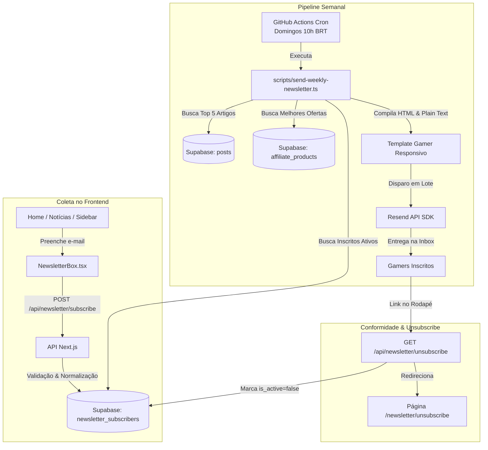

# Módulo de Newsletter Automática Gamer (Fase 3)

O **AIGamePortal** possui um sistema autônomo de e-mail marketing semanal projetado para engajamento contínuo da comunidade gamer e monetização por afiliados.

Todo **domingo às 10:00 BRT**, o pipeline compila os 5 artigos mais lidos e relevantes dos últimos 7 dias, seleciona as melhores ofertas de produtos gamer em destaque e dispara um e-mail responsivo moderno utilizando a infraestrutura oficial da **Resend**.

---

## 1. Arquitetura do Sistema



---

## 2. Modelagem no Supabase

Execute a migração disponível em [`supabase/migrations/20260916000001_newsletter_subscribers.sql`](../supabase/migrations/20260916000001_newsletter_subscribers.sql) no SQL Editor do Supabase:

```sql
CREATE TABLE IF NOT EXISTS public.newsletter_subscribers (
    id UUID PRIMARY KEY DEFAULT gen_random_uuid(),
    email TEXT NOT NULL UNIQUE,
    is_active BOOLEAN NOT NULL DEFAULT true,
    subscribed_at TIMESTAMPTZ NOT NULL DEFAULT now(),
    unsubscribed_at TIMESTAMPTZ
);

-- Índices de Alta Performance
CREATE UNIQUE INDEX IF NOT EXISTS idx_newsletter_subscribers_email_lower
    ON public.newsletter_subscribers (lower(trim(email)));

CREATE INDEX IF NOT EXISTS idx_newsletter_subscribers_active
    ON public.newsletter_subscribers (is_active)
    WHERE is_active = true;

-- Políticas RLS (Row Level Security)
ALTER TABLE public.newsletter_subscribers ENABLE ROW LEVEL SECURITY;

-- Permitir que visitantes se inscrevam
CREATE POLICY "Permitir inscricao publica na newsletter"
    ON public.newsletter_subscribers
    FOR INSERT
    TO anon, authenticated
    WITH CHECK (true);

-- Proteger e-mails contra vazamentos (apenas service_role pode ler)
CREATE POLICY "Permitir leitura apenas para service_role"
    ON public.newsletter_subscribers
    FOR SELECT
    TO service_role
    USING (true);

CREATE POLICY "Permitir gerenciamento total apenas para service_role"
    ON public.newsletter_subscribers
    FOR ALL
    TO service_role
    USING (true)
    WITH CHECK (true);
```

### 2.2 Tabela de Parâmetros e Salvaguarda (`newsletter_settings`)

Disponível na migração [`supabase/migrations/20260916000003_newsletter_settings.sql`](../supabase/migrations/20260916000003_newsletter_settings.sql):

- Por padrão de segurança, o envio semanal **inicia desabilitado** (`is_enabled: false`) até ser expressamente ativado no painel administrativo.
- O pipeline semanal (`scripts/send-weekly-newsletter.ts`) consulta este status e aborta de forma segura (`skipped`) caso o envio esteja pausado.

Consulte o guia completo da área administrativa em [docs/admin-newsletter.md](./admin-newsletter.md).

---

## 3. Componente Frontend (`NewsletterBox.tsx`)

O formulário de captura foi desenhado com identidade visual gamer de alto nível:
- Bordas e gradientes neon (`brand-purple` e `brand-cyan`).
- Microinterações e feedback imediato de validação, loading spinner e mensagens de sucesso/erro.
- Tratamento automático para assinantes já cadastrados.
- Duas variantes de layout:
  - `variant="default"`: Largura ampla para a Página Inicial.
  - `variant="sidebar"`: Formato compacto otimizado para barras laterais das matérias e da Home.

### Exemplo de Uso:
```tsx
import { NewsletterBox } from "@/components/NewsletterBox";

// No rodapé ou seção especial da página:
<NewsletterBox variant="default" />

// Em colunas ou barras laterais estreitas:
<NewsletterBox variant="sidebar" />
```

---

## 4. Endpoints de API

### Inscrição: `POST /api/newsletter/subscribe`
- **Rate Limit**: Máximo de 3 inscrições por minuto por IP (mitigação contra bots de spam).
- **Body**: `{ "email": "gamer@dominio.com" }`
- **Validações**:
  - Regex RFC 5322 e normalização para minúsculas.
  - Se já estiver cadastrado e ativo: retorna aviso amigável sem duplicar registros.
  - Se estiver com cadastro cancelado: reativa automaticamente (`is_active = true`).
  - Se for novo: insere registro e retorna confirmação.

### Descadastro Seguro: `GET` & `POST /api/newsletter/unsubscribe`
- Conforme as leis de proteção de dados (LGPD, CAN-SPAM e RFC 8058):
  - **`GET /api/newsletter/unsubscribe?email=...&token=...`**: Idempotente (sem mutação no banco). Redireciona o usuário para a interface amigável de confirmação [`/newsletter/unsubscribe`](../app/newsletter/unsubscribe/page.tsx). Scanners automáticos de antivírus não desativam mais o usuário indevidamente.
  - **`POST /api/newsletter/unsubscribe`**: Endpoint com mutação segura, protegido por **Rate Limiting** (5 req/min) e **CSRF Same-Origin**. Exige o token criptográfico `HMAC-SHA256(email, SECRET)`. Atualiza `is_active = false` e `unsubscribed_at = now()`.
  - **Suporte RFC 8058 One-Click**: Clientes de e-mail modernos (Gmail, Yahoo) realizam o cancelamento direto via cabeçalhos `List-Unsubscribe` e `List-Unsubscribe-Post`.

---

## 5. Script de Disparo (`scripts/send-weekly-newsletter.ts`)

Disponível através do comando:
```bash
npm run newsletter:send
```

### Argumentos Suportados:
1. **Modo Dry-Run (Simulação sem envio real)**:
   ```bash
   npm run newsletter:send -- --dry-run
   ```
   *Busca os dados reais no banco, compila o HTML responsivo, valida a compatibilidade e gera um arquivo local em `scratch/newsletter-preview.html` para visualização no navegador.*

2. **Teste Direcionado para um único e-mail**:
   ```bash
   npm run newsletter:send -- --test-email=seu-email@gmail.com
   ```
   *Envia a edição real apenas para o e-mail informado para validação visual no Gmail/Outlook antes do disparo oficial.*

---

## 6. Automação com GitHub Actions

O workflow [`.github/workflows/cron-weekly-newsletter.yml`](../.github/workflows/cron-weekly-newsletter.yml) é responsável pelo agendamento:

- **Cron**: `0 13 * * 0` (Todo domingo às 13:00 UTC = 10:00 BRT).
- **Disparo Manual**: Ativado via `workflow_dispatch` com opções de marcar `dry_run` e fornecer `test_email`.
- **Segredos Obrigatórios no GitHub (`Settings > Secrets and variables > Actions`)**:
  - `RESEND_API_KEY`: Chave de API gerada no painel da Resend.
  - `RESEND_FROM_EMAIL`: E-mail remetente autenticado (ex: `AIGamePortal <newsletter@seudominio.com>` ou `AIGamePortal <onboarding@resend.dev>`).
  - `SUPABASE_URL`: URL do projeto Supabase.
  - `SUPABASE_SERVICE_ROLE_KEY`: Chave de serviço para bypass de RLS na leitura de inscritos.
  - `NEXT_PUBLIC_SITE_URL`: Domínio público do portal (ex: `https://aigameportal.com`).

---

## 7. Compatibilidade do Template de E-mail

O template HTML foi estruturado com as melhores práticas da indústria de e-mail marketing:
- **Tabelas aninhadas e estilos 100% inline**: Garante renderização perfeita no Outlook Desktop (que utiliza o motor Word para renderização), Gmail Web/App e Apple Mail.
- **Paleta de Cores Gamer**: Fundo `#090d16`, cards `#111827`, destaques `#8b5cf6` e `#06b6d4`.
- **Versão Plain Text Automática**: Acompanha cada e-mail para garantir nota máxima nos filtros anti-spam (SpamAssassin / SPF / DKIM / DMARC).
