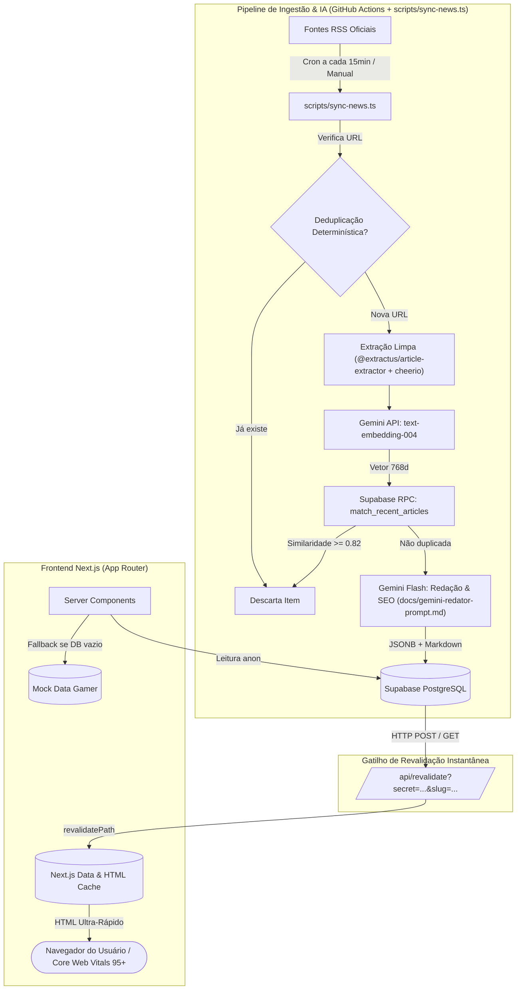

# Arquitetura do Sistema — AIGamePortal

Este documento detalha as decisões arquiteturais, padrões de fluxo de dados, modelo de renderização híbrida (SSG + ISR) e os princípios de engenharia aplicados no **AIGamePortal**.

---

## 1. Visão Geral da Arquitetura

O AIGamePortal opera sob um modelo de **arquitetura orientada a eventos e regeneração estática sob demanda**. O sistema desacopla completamente o pipeline pesado de crawling/IA (executado periodicamente via **GitHub Actions** com script TypeScript autônomo) da entrega de páginas web aos usuários finais (servida via Next.js com cache em CDN).



> 💡 **Nota sobre o Agente de IA**: A especificação detalhada do **Agente Redator & Otimizador SEO** (System Prompt, Few-Shot, JSON Schema estrito e mitigação anti-alucinação) encontra-se em **[docs/gemini-redator-prompt.md](file:///d:/IAProjects/AIGamePortal/docs/gemini-redator-prompt.md)**.


---

## 2. Estratégia Híbrida de Renderização: SSG + ISR

O portal atinge notas **95+ em Core Web Vitals** (LCP < 1.2s, CLS = 0, FID/INP instantâneo) através da eliminação de SSR (Server-Side Rendering) bloqueante em tempo de requisição.

### 2.1 Static Site Generation (SSG)
- **Como funciona**: No momento da compilação (`npm run build`), o Next.js executa a função `generateStaticParams()` declarada em:
  - `app/noticias/[slug]/page.tsx`: Pré-renderiza todas as notícias cadastradas no acervo.
  - `app/categoria/[slug]/page.tsx`: Pré-renderiza os canais de todas as plataformas cadastradas (`playstation`, `xbox`, `nintendo`, etc.).
- **Resultado**: Todas as páginas são exportadas como arquivos estáticos (HTML + JSON de dados), servíveis instantaneamente a partir de CDNs sem tocar no banco de dados para leituras de usuários.

### 2.2 Incremental Static Regeneration (ISR)
O projeto implementa duas camadas complementares de ISR:

1. **Revalidação Periódica de Fundo (Fallback)**:
   - Homepage e Categorias: `export const revalidate = 120;` (a cada 2 minutos).
   - Páginas de Notícia: `export const revalidate = 300;` (a cada 5 minutos).
   - Caso nenhum webhook seja disparado, o Next.js regenera a página em background de forma assíncrona após o intervalo estabelecido, garantindo que o cache nunca fique obsoleto.

2. **Revalidação Sob Demanda via Webhook (Instantânea)**:
   - Endpoint: `app/api/revalidate/route.ts`.
   - Assim que o nó final do n8n realiza o `INSERT` na tabela `public.posts`, ele dispara uma chamada `POST /api/revalidate?secret=...&slug=slug-da-materia`.
   - O endpoint invoca internamente `revalidatePath('/noticias/' + slug)` e `revalidatePath('/')`, invalidando o cache estático em **menos de 500ms**.
   - O próximo leitor da matéria já recebe a versão finalizada do artigo sem qualquer atraso de cache.

---

## 3. Filosofia de Componentes: Server vs Client

Para garantir que o bundle de JavaScript baixado pelo navegador do leitor seja mínimo (cerca de 103 kB compartilhados), aplicamos uma separação estrita de responsabilidades:

| Componente | Tipo | Justificativa Técnica |
| :--- | :---: | :--- |
| `app/layout.tsx` | **Server** | Busca categorias no banco e injeta metadados sem código no cliente. |
| `app/page.tsx` | **Server** | Monta Hero, Grid e Sidebar estaticamente. |
| `app/noticias/[slug]/page.tsx` | **Server** | Renderiza conteúdo em Markdown e gera JSON-LD estruturado sem overhead de runtime. |
| `components/hero-featured.tsx` | **Server** | Renderiza imagens e metadados estáticos. |
| `components/news-card.tsx` | **Server** | Markup estático com classes de hover via Tailwind puro. |
| `components/tldr-box.tsx` | **Server** | Lista estática de bullets formatados. |
| `components/game-metadata-card.tsx`| **Server** | Renderiza tabela de especificações técnicas do jogo. |
| `components/community-sentiment-box.tsx`| **Server** | Exibe resumo de reações da comunidade. |
| `components/eeat-attribution-box.tsx`| **Server** | Card de conformidade editorial e link canônico. |
| `components/theme-toggle.tsx` | **Client** | Necessita de hooks de browser (`useTheme`, `useState`, `useEffect`) para alternar tema sem hidratação incorreta. |
| `components/share-buttons.tsx` | **Client** | Acessa `navigator.clipboard` e manipula eventos de clique de compartilhamento. |
| `components/header.tsx` | **Client** | Controla o estado de abertura/fechamento do menu mobile (`mobileMenuOpen`). |

---

## 4. Camada de Resiliência de Dados (Supabase + Fallback)

O módulo `lib/data/api.ts` atua como uma fachada resiliente. Ele abstrai o estado de conectividade do banco de dados:

```typescript
// Fluxo lógico em lib/data/api.ts
export async function getLatestPosts(limit = 12): Promise<Post[]> {
  // 1. Verifica se credenciais válidas do Supabase existem
  if (!isSupabaseConfigured) {
    return MOCK_POSTS.slice(0, limit);
  }

  try {
    const supabase = createServerClient();
    // 2. Consulta a tabela de posts com relacionamentos (categories, sources)
    const { data, error } = await supabase.from('posts').select(...);
    
    // 3. Se o banco estiver vazio ou retornar erro, comuta suavemente para os mocks
    if (error || !data || data.length === 0) {
      return MOCK_POSTS.slice(0, limit);
    }

    return data as Post[];
  } catch {
    // 4. Captura falhas de rede sem quebrar a renderização da página
    return MOCK_POSTS.slice(0, limit);
  }
}
```

### Vantagens dessa abordagem:
1. **Zero Downtime em Desenvolvimento**: Qualquer desenvolvedor pode clonar o projeto e rodar `npm run dev` com a interface 100% preenchida sem precisar subir credenciais do Supabase.
2. **Resiliência em Build**: Se a API do Supabase passar por instabilidade temporária durante a compilação do CI/CD, o build estático conclui com sucesso utilizando a base canônica de dados de demonstração.

---

## 5. Arquitetura de Imagens e Pipeline Resiliente

O AIGamePortal implementa uma arquitetura defensiva multicamada para garantir que nenhuma notícia seja publicada ou renderizada com capas quebradas, links corrompidos ou arquivos de áudio indesejados.

### 5.1 Pipeline de Extração em 7 Etapas ([scripts/sync-news.ts](file:///d:/IAProjects/AIGamePortal/scripts/sync-news.ts))

Durante o ciclo de sincronização de notícias, o script de ingestão executa uma hierarquia defensiva para determinar a melhor imagem de capa (`cover_image_url`):

1. **Tags Yahoo Media RSS (`media:content` e `media:thumbnail`)**:
   - Mapeadas nativamente via `customFields` no `rss-parser`.
   - Captura imagens de alta resolução de portais como Nintendo Life, IGN Games e PC Gamer.
2. **Inspeção de Enclosure com Filtro Anti-Áudio**:
   - Inspeciona a tag `<enclosure>`, rejeitando expressamente itens com `type="audio/*"` ou extensões de áudio/vídeo (`.mp3`, `.wav`, `.m4a`, `.mp4`).
   - Evita que episódios de podcasts (como o *PlayStation Podcast*) tenham seu arquivo de áudio gravado no campo de imagem.
3. **Varredura no HTML Embutido do Feed**:
   - Analisa fragmentos em `content:encoded` via Cheerio buscando tags `` válidas.
4. **Extração de Artigo (`@extractus/article-extractor`)**:
   - Tenta extrair a imagem destacada diretamente do DOM da página do artigo original.
5. **Fallback de Conteúdo Estruturado**:
   - Utiliza resumos e imagens secundárias do próprio feed caso a página externa bloqueie o acesso.
6. **Varredura OpenGraph (`fetchOgImage`)**:
   - Realiza uma requisição com headers realistas de navegador (`User-Agent`, `Accept`) para extrair `<meta property="og:image">` ou `<meta name="twitter:image">`.
7. **Detecção Anti-Hotlink (Cloudflare Challenge) & Fallback Temático por Categoria**:
   - CDNs protegidas por Cloudflare Managed Challenge (como `images.nintendolife.com`) respondem com HTTP 403 Forbidden e páginas HTML de captcha para acessos externos.
   - O validador central descarta automaticamente essas URLs protegidas, ativando o fallback por categoria (`FALLBACK_COVERS_BY_CATEGORY`), que seleciona wallpapers temáticos de alta definição correspondentes à plataforma da notícia (**PlayStation**, **Xbox**, **Nintendo**, **PC Gaming** ou **Geral**).

### 5.2 Validador Centralizado de Imagens (`isValidImageUrl`)

Tanto no script de ingestão quanto no frontend ([lib/utils.ts](file:///d:/IAProjects/AIGamePortal/lib/utils.ts)), a função central `isValidImageUrl` atua como barreira de segurança:
```typescript
export function isValidImageUrl(url?: string | null): boolean {
  if (!url || typeof url !== "string") return false;
  const trimmed = url.trim();
  if (!trimmed.startsWith("http://") && !trimmed.startsWith("https://")) return false;
  // Rejeita extensões de áudio e vídeo comuns em feeds/enclosures
  if (/\.(mp3|wav|ogg|m4a|aac|flac|mp4|webm|mkv|avi)(\?.*)?$/i.test(trimmed)) return false;
  // Rejeita CDNs conhecidas por Cloudflare Bot Challenge bloqueando hotlinking
  if (trimmed.includes("images.nintendolife.com")) return false;
  return true;
}
```

### 5.3 Configuração do Next.js Image Optimization ([next.config.ts](file:///d:/IAProjects/AIGamePortal/next.config.ts))

O Next.js é configurado com wildcard global nos protocolos `https` e `http`, permitindo a otimização de imagens de qualquer assessoria de imprensa ou CDN oficial de videogame:
```typescript
images: {
  remotePatterns: [
    { protocol: "https", hostname: "**" },
    { protocol: "http", hostname: "**" },
  ],
}
```

### 5.4 Proteção nos Componentes de Interface

Os componentes visuais ([NewsCard](file:///d:/IAProjects/AIGamePortal/components/news-card.tsx), [HeroFeatured](file:///d:/IAProjects/AIGamePortal/components/hero-featured.tsx) e [app/noticias/[slug]/page.tsx](file:///d:/IAProjects/AIGamePortal/app/noticias/[slug]/page.tsx)) nunca invocam o componente `<Image />` com dados crus do banco. Eles validam `hasValidImage = isValidImageUrl(post.cover_image_url)`. Se a URL for inválida ou ausente, a interface exibe de forma harmoniosa um gradiente escuro com ícone de raio neon, mantendo o layout intacto.

### 5.5 Tipografia com `next/font`

- Fontes `Inter` (leitura editorial) e `Outfit` (estética gamer) são carregadas com `display: "swap"` e declaradas como variáveis CSS (`--font-inter`, `--font-outfit`), sem gerar requisições de rede em tempo de execução para servidores do Google.
