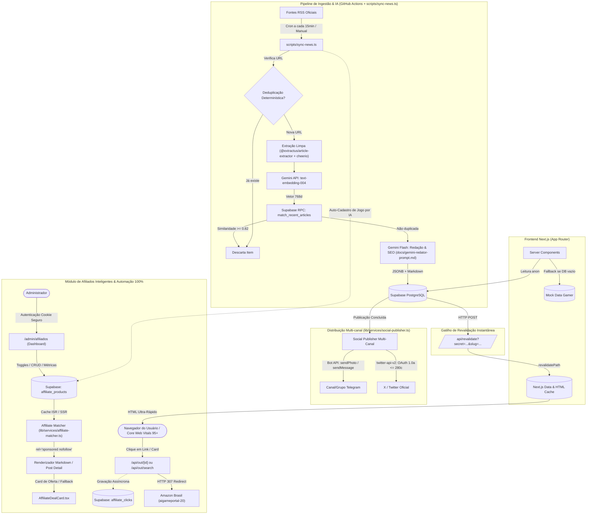

# Arquitetura do Sistema — AIGamePortal

Este documento detalha as decisões arquiteturais, padrões de fluxo de dados, modelo de renderização híbrida (SSG + ISR) e os princípios de engenharia aplicados no **AIGamePortal**.

---

## 1. Visão Geral da Arquitetura

O AIGamePortal opera sob um modelo de **arquitetura orientada a eventos e regeneração estática sob demanda**. O sistema desacopla completamente o pipeline pesado de crawling/IA (executado periodicamente via **GitHub Actions** com script TypeScript autônomo) da entrega de páginas web aos usuários finais (servida via Next.js com cache em CDN).



> 💡 **Nota sobre o Agente de IA**: A especificação detalhada do **Agente Redator & Otimizador SEO** (System Prompt, Few-Shot, JSON Schema estrito e mitigação anti-alucinação) encontra-se em **[docs/gemini-redator-prompt.md](file:///d:/IAProjects/AIGamePortal/docs/gemini-redator-prompt.md)**.


---

## 2. Estratégia Híbrida de Renderização: SSG + ISR

O portal atinge notas **95+ em Core Web Vitals** (LCP < 1.2s, CLS = 0, FID/INP instantâneo) através da eliminação de SSR (Server-Side Rendering) bloqueante em tempo de requisição.

### 2.1 Static Site Generation (SSG)
- **Como funciona**: No momento da compilação (`npm run build`), o Next.js executa a função `generateStaticParams()` declarada em:
  - `app/noticias/[slug]/page.tsx`: Pré-renderiza todas as notícias cadastradas no acervo.
  - `app/categoria/[slug]/page.tsx`: Pré-renderiza os canais de todas as plataformas cadastradas (`playstation`, `xbox`, `nintendo`, etc.).
- **Resultado**: Todas as páginas são exportadas como arquivos estáticos (HTML + JSON de dados), servíveis instantaneamente a partir de CDNs sem tocar no banco de dados para leituras de usuários.

### 2.2 Incremental Static Regeneration (ISR)
O projeto implementa duas camadas complementares de ISR:

1. **Revalidação Periódica de Fundo (Fallback)**:
   - Homepage e Categorias: `export const revalidate = 120;` (a cada 2 minutos).
   - Páginas de Notícia: `export const revalidate = 300;` (a cada 5 minutos).
   - Caso nenhum webhook seja disparado, o Next.js regenera a página em background de forma assíncrona após o intervalo estabelecido, garantindo que o cache nunca fique obsoleto.

2. **Revalidação Sob Demanda via Webhook (Instantânea)**:
   - Endpoint: `app/api/revalidate/route.ts`.
   - Assim que o nó final do n8n realiza o `INSERT` na tabela `public.posts`, ele dispara uma chamada `POST /api/revalidate?secret=...&slug=slug-da-materia`.
   - O endpoint invoca internamente `revalidatePath('/noticias/' + slug)` e `revalidatePath('/')`, invalidando o cache estático em **menos de 500ms**.
   - O próximo leitor da matéria já recebe a versão finalizada do artigo sem qualquer atraso de cache.

---

## 3. Filosofia de Componentes: Server vs Client

Para garantir que o bundle de JavaScript baixado pelo navegador do leitor seja mínimo (cerca de 103 kB compartilhados), aplicamos uma separação estrita de responsabilidades:

| Componente | Tipo | Justificativa Técnica |
| :--- | :---: | :--- |
| `app/layout.tsx` | **Server** | Busca categorias no banco e injeta metadados sem código no cliente. |
| `app/page.tsx` | **Server** | Monta Hero, Grid e Sidebar estaticamente. |
| `app/noticias/[slug]/page.tsx` | **Server** | Renderiza conteúdo em Markdown e gera JSON-LD estruturado sem overhead de runtime. |
| `components/hero-featured.tsx` | **Server** | Renderiza imagens e metadados estáticos. |
| `components/news-card.tsx` | **Server** | Markup estático com classes de hover via Tailwind puro. |
| `components/tldr-box.tsx` | **Server** | Lista estática de bullets formatados. |
| `components/game-metadata-card.tsx`| **Server** | Renderiza tabela de especificações técnicas do jogo. |
| `components/community-sentiment-box.tsx`| **Server** | Exibe resumo de reações da comunidade. |
| `components/eeat-attribution-box.tsx`| **Server** | Card de conformidade editorial e link canônico. |
| `components/theme-toggle.tsx` | **Client** | Necessita de hooks de browser (`useTheme`, `useState`, `useEffect`) para alternar tema sem hidratação incorreta. |
| `components/share-buttons.tsx` | **Client** | Acessa `navigator.clipboard` e manipula eventos de clique de compartilhamento. |
| `components/header.tsx` | **Client** | Controla o estado de abertura/fechamento do menu mobile (`mobileMenuOpen`). |

---

## 4. Camada de Resiliência de Dados (Supabase + Fallback)

O módulo `lib/data/api.ts` atua como uma fachada resiliente. Ele abstrai o estado de conectividade do banco de dados:

```typescript
// Fluxo lógico em lib/data/api.ts
export async function getLatestPosts(limit = 12): Promise<Post[]> {
  // 1. Verifica se credenciais válidas do Supabase existem
  if (!isSupabaseConfigured) {
    return MOCK_POSTS.slice(0, limit);
  }

  try {
    const supabase = createServerClient();
    // 2. Consulta a tabela de posts com relacionamentos (categories, sources)
    const { data, error } = await supabase.from('posts').select(...);
    
    // 3. Se o banco estiver vazio ou retornar erro, comuta suavemente para os mocks
    if (error || !data || data.length === 0) {
      return MOCK_POSTS.slice(0, limit);
    }

    return data as Post[];
  } catch {
    // 4. Captura falhas de rede sem quebrar a renderização da página
    return MOCK_POSTS.slice(0, limit);
  }
}
```

### Vantagens dessa abordagem:
1. **Zero Downtime em Desenvolvimento**: Qualquer desenvolvedor pode clonar o projeto e rodar `npm run dev` com a interface 100% preenchida sem precisar subir credenciais do Supabase.
2. **Resiliência em Build**: Se a API do Supabase passar por instabilidade temporária durante a compilação do CI/CD, o build estático conclui com sucesso utilizando a base canônica de dados de demonstração.

---

## 5. Arquitetura de Imagens e Pipeline Resiliente

O AIGamePortal implementa uma arquitetura defensiva multicamada para garantir que nenhuma notícia seja publicada ou renderizada com capas quebradas, links corrompidos ou arquivos de áudio indesejados.

### 5.1 Pipeline de Extração em 7 Etapas ([scripts/sync-news.ts](file:///d:/IAProjects/AIGamePortal/scripts/sync-news.ts))

Durante o ciclo de sincronização de notícias, o script de ingestão executa uma hierarquia defensiva para determinar a melhor imagem de capa (`cover_image_url`):

1. **Tags Yahoo Media RSS (`media:content` e `media:thumbnail`)**:
   - Mapeadas nativamente via `customFields` no `rss-parser`.
   - Captura imagens de alta resolução de portais como Nintendo Life, IGN Games e PC Gamer.
2. **Inspeção de Enclosure com Filtro Anti-Áudio**:
   - Inspeciona a tag `<enclosure>`, rejeitando expressamente itens com `type="audio/*"` ou extensões de áudio/vídeo (`.mp3`, `.wav`, `.m4a`, `.mp4`).
   - Evita que episódios de podcasts (como o *PlayStation Podcast*) tenham seu arquivo de áudio gravado no campo de imagem.
3. **Varredura no HTML Embutido do Feed**:
   - Analisa fragmentos em `content:encoded` via Cheerio buscando tags `` válidas.
4. **Extração de Artigo (`@extractus/article-extractor`)**:
   - Tenta extrair a imagem destacada diretamente do DOM da página do artigo original.
5. **Fallback de Conteúdo Estruturado**:
   - Utiliza resumos e imagens secundárias do próprio feed caso a página externa bloqueie o acesso.
6. **Varredura OpenGraph (`fetchOgImage`)**:
   - Realiza uma requisição com headers realistas de navegador (`User-Agent`, `Accept`) para extrair `<meta property="og:image">` ou `<meta name="twitter:image">`.
7. **Detecção Anti-Hotlink (Cloudflare Challenge) & Fallback Temático por Categoria**:
   - CDNs protegidas por Cloudflare Managed Challenge (como `images.nintendolife.com`) respondem com HTTP 403 Forbidden e páginas HTML de captcha para acessos externos.
   - O validador central descarta automaticamente essas URLs protegidas, ativando o fallback por categoria (`FALLBACK_COVERS_BY_CATEGORY`), que seleciona wallpapers temáticos de alta definição correspondentes à plataforma da notícia (**PlayStation**, **Xbox**, **Nintendo**, **PC Gaming** ou **Geral**).

### 5.2 Validador Centralizado de Imagens (`isValidImageUrl`)

Tanto no script de ingestão quanto no frontend ([lib/utils.ts](file:///d:/IAProjects/AIGamePortal/lib/utils.ts)), a função central `isValidImageUrl` atua como barreira de segurança:
```typescript
export function isValidImageUrl(url?: string | null): boolean {
  if (!url || typeof url !== "string") return false;
  const trimmed = url.trim();
  if (!trimmed.startsWith("http://") && !trimmed.startsWith("https://")) return false;
  // Rejeita extensões de áudio e vídeo comuns em feeds/enclosures
  if (/\.(mp3|wav|ogg|m4a|aac|flac|mp4|webm|mkv|avi)(\?.*)?$/i.test(trimmed)) return false;
  // Rejeita CDNs conhecidas por Cloudflare Bot Challenge bloqueando hotlinking
  if (trimmed.includes("images.nintendolife.com")) return false;
  return true;
}
```

### 5.3 Configuração do Next.js Image Optimization ([next.config.ts](file:///d:/IAProjects/AIGamePortal/next.config.ts))

O Next.js é configurado com wildcard global nos protocolos `https` e `http`, permitindo a otimização de imagens de qualquer assessoria de imprensa ou CDN oficial de videogame:
```typescript
images: {
  remotePatterns: [
    { protocol: "https", hostname: "**" },
    { protocol: "http", hostname: "**" },
  ],
}
```

### 5.4 Proteção nos Componentes de Interface

Os componentes visuais ([NewsCard](file:///d:/IAProjects/AIGamePortal/components/news-card.tsx), [HeroFeatured](file:///d:/IAProjects/AIGamePortal/components/hero-featured.tsx) e [app/noticias/[slug]/page.tsx](file:///d:/IAProjects/AIGamePortal/app/noticias/[slug]/page.tsx)) nunca invocam o componente `<Image />` com dados crus do banco. Eles validam `hasValidImage = isValidImageUrl(post.cover_image_url)`. Se a URL for inválida ou ausente, a interface exibe de forma harmoniosa um gradiente escuro com ícone de raio neon, mantendo o layout intacto.

### 5.5 Tipografia com `next/font`

- Fontes `Inter` (leitura editorial) e `Outfit` (estética gamer) são carregadas com `display: "swap"` e declaradas como variáveis CSS (`--font-inter`, `--font-outfit`), sem gerar requisições de rede em tempo de execução para servidores do Google.

---

## 6. Distribuição Multi-canal Automática (Fase 2)

Para maximizar a tração orgânica e o engajamento imediato com a comunidade gamer, o pipeline integra o módulo [lib/services/social-publisher.ts](file:///d:/IAProjects/AIGamePortal/lib/services/social-publisher.ts), acionado imediatamente após a persistência do post no banco de dados e a revalidação do ISR.

### 6.1 Princípios de Resiliência e Falha Segura (Non-Blocking)
- **Desacoplamento Estrito**: Falhas em redes sociais (rate limit da API do X/Twitter, timeout no Telegram ou tokens ausentes) **nunca** abortam nem invalidam o salvamento da notícia no Supabase.
- **Execução Concorrente**: Utiliza `Promise.allSettled` para disparar Telegram e Twitter simultaneamente, isolando falhas por canal.
- **Degradação Graciosa**: Quando as credenciais de uma rede social não estão presentes no ambiente, o canal é ignorado emitindo apenas um aviso de log estruturado (`skipped: true`).

### 6.2 Social Copywriter Adaptativo
- **Ganchos Gamer**: Emojis temáticos (`🎮`, `🚨`, `💥`) e detecção de credibilidade (se `is_rumor: true`, prefixa obrigatoriamente `🚨 [RUMOR]`).
- **Telegram**:
  - Envio de foto em alta resolução via `sendPhoto` com fallback para `sendMessage`.
  - Legenda rica com formatação HTML sanitizada (`parse_mode: 'HTML'`).
  - Botão inline interativo *"Ler Matéria Completa 🎮"* com link canônico para o portal.
- **X (Twitter)**:
  - Integração oficial com `twitter-api-v2` sob OAuth 1.0a User Context.
  - Algoritmo de compressão dinâmico com garantia matemática de cumprimento do limite estrito de **280 caracteres** (compensando os 23 caracteres fixos da URL via `t.co`).
  - Hashtags estratégicas geradas dinamicamente com base na categoria e plataformas do jogo.

---

## 7. Módulo de Afiliados Inteligentes & Monetização (Fase 3)

O sistema de afiliados foi desenhado para maximizar a conversão orgânica sem comprometer a experiência de leitura e mantendo **estrita conformidade com as diretrizes de links pagos do Google (E-E-A-T)**.

### 7.1 Injetor Inteligente de Links Contextuais ([lib/services/affiliate-matcher.ts](file:///d:/IAProjects/AIGamePortal/lib/services/affiliate-matcher.ts))
- **Casamento de Palavras-chave com Prioridade**: As palavras-chave do catálogo são ordenadas pelo comprimento em ordem decrescente (ex: `"PlayStation 5 Pro"` tem precedência sobre `"PS5"`, evitando substituições fragmentadas).
- **Proteção Estrutural de Conteúdo**: O analisador ignora cabeçalhos Markdown (`#`, `##`, `###`), blocos de código e links pré-existentes.
- **Teto de Densidade**: Limita a inserção a no máximo 2 a 3 links contextuais por artigo, evitando poluição visual e alertas anti-spam.
- **Conformidade Google E-E-A-T**: Todo link contextual gerado inclui obrigatoriamente os atributos:
  ```html
  rel="sponsored nofollow" target="_blank"
  ```
  Isso protege o portal de penalizações manuais ou algorítmicas de PageRank do Google.

### 7.2 Rota de Redirecionamento e Rastreamento ([app/api/out/[id]/route.ts](file:///d:/IAProjects/AIGamePortal/app/api/out/[id]/route.ts))
- **Tratamento de Requisição**: `GET /api/out/[id]?postId=...`
- **Registro Assíncrono de Métricas**: O evento de clique é gravado de forma não-bloqueante na tabela `affiliate_clicks` com `referrer` e `user_agent`.
- **Redirecionamento Rápido**: Retorna status **HTTP 307 (Temporary Redirect)** diretamente para a `affiliate_url` do parceiro com cabeçalhos `Cache-Control: no-store` para assegurar a contagem exata de cada acesso.
- **Fail-Safe**: Identificadores inválidos ou produtos desativados redirecionam instantaneamente para a Home do portal, sem expor mensagens de erro cruas ao usuário.

### 7.3 Card Gamer de Recomendação ([components/AffiliateDealCard.tsx](file:///d:/IAProjects/AIGamePortal/components/AffiliateDealCard.tsx))
- Posicionado estrategicamente ao término da matéria.
- Destaca a melhor oferta identificada para o jogo ou console em questão (`findBestAffiliateDeal`).
- Inclui badge *"Oferta Recomendada"*, preço estimado em BRL, nome da loja parceira e call-to-action de alta conversão.
- Exibe de forma transparente o aviso E-E-A-T: *"Comprando pelos nossos links, o portal pode receber uma comissão sem custo adicional para você."*

### 7.4 As 4 Camadas de Automação Integral
1. **Auto-Cadastro por IA (`scripts/sync-news.ts`)**: No momento em que o pipeline jornalístico publica uma notícia de jogo, o sistema cadastra autonomamente o produto na Amazon Brasil com a tag `aigameportal-20`.
2. **Smart Search Fallback (`app/api/out/search/route.ts`)**: Para matérias sem produtos físicos específicos, o sistema gera links de busca direcionada na Amazon Brasil com tracking completo, alcançando 100% de cobertura de monetização passiva.
3. **Auditoria Autônoma por Cron (`scripts/sync-affiliates.ts`)**: Rotina de background para auditar e reforçar a tag da Amazon Brasil em todos os links e garantir que parceiros inativos (KaBuM! e Nuuvem) permaneçam pausados até liberação.
4. **Portal Administrativo Visual (`/admin/afiliados`)**: Interface visual para controle total pelo administrador.

### 7.5 Subsistema de Administração Segura (`/admin/afiliados`)
- **Autenticação Server-Side**: Proteção via cookie HTTP-only `admin_session` gerado por comparação segura com `ADMIN_SECRET_KEY`.
- **Prevenção de Indexação**: Metadados de página configurados com `robots: { index: false, follow: false }` e bloqueio explícito no `robots.txt` para proteger a área contra indexação nos motores de busca.
- **Operação em Tempo Real**: Gestão visual de catálogo, métricas de cliques por produto e botões liga/desliga integrados diretamente ao banco Supabase.

---

## 8. Mídia Programática & Otimização de Core Web Vitals (Fase 3)

### 8.1 Prevenção Absoluta de Cumulative Layout Shift (CLS = 0)
Anúncios dinâmicos de redes como Google AdSense frequentemente degradam a métrica de **Cumulative Layout Shift (CLS)** ao empurrar abruptamente o conteúdo da página quando o script remoto injeta um `<iframe>` de altura desconhecida. Para resolver esse problema estruturalmente:
1. **Dimensionamento Antecipado Obrigatório**: O componente `<AdBanner />` implementa contêineres com altura mínima estrita reservada via Tailwind CSS antes de qualquer execução de JavaScript:
   - `in-article-top`: `min-h-[280px] md:min-h-[114px]` (reservado para 300x250 no mobile e 728x90 no desktop).
   - `in-article-mid`: `min-h-[290px]` (reservado para 300x250/336x280 + padding).
   - `sidebar-sticky`: `min-h-[630px]` (reservado para 300x600 skyscraper na lateral de leitura).
2. **Isolamento Visual Neutro**: O contêiner de anúncio possui background neutro sutil (`bg-zinc-100/80 dark:bg-gamer-900/60`), borda delimitadora tracejada e label regulatória `"PUBLICIDADE"` permanente. Quando o anúncio é carregado, ele substitui a área sem qualquer salto visual ou re-flow no navegador.

### 8.2 Inserção Dinâmica no Corpo da Notícia ([lib/utils/content-parser.tsx](file:///d:/IAProjects/AIGamePortal/lib/utils/content-parser.tsx))
- O helper `splitContentForMidArticleAd` analisa os blocos de texto e conta unicamente parágrafos autênticos, ignorando cabeçalhos `#`, blockquotes `>`, listas `-` ou blocos de código ````.
- O bloco `in-article-mid` é inserido de forma não-destrutiva exatamente após o 3º parágrafo da matéria, maximizando o CTR (Click-Through Rate) e respeitando as normas da Coalition for Better Ads.

### 8.3 Fallback Inteligente & Prevenção de Banners Vazios (Zero Blank Space)
O sistema foi arquitetado para **nunca deixar espaços pretos/brancos vazios** no portal:
- **Estratégia Default-Visible**: O banner de Fallback ("Destaques Gamer" com ofertas da Amazon Brasil ou Telegram) permanece montado e visível por padrão desde o primeiro instante de renderização.
- **Detecção Confiável por `MutationObserver`**: O componente monitora o atributo oficial `data-ad-status` no `<ins class="adsbygoogle">`. Apenas quando o Google AdSense reporta explicitamente `data-ad-status="filled"` o fallback dá lugar ao anúncio programático.
- **Tratamento de Ambientes Restritos**: Em `localhost`, redes com bloqueador de anúncios (AdBlock) ou em contas do AdSense com domínios pendentes de aprovação pelo Google, o AdSense não entrega criativos. O sistema detecta esse comportamento em 1.2 segundos (ou instantaneamente em erros/unfilled) e mantém a exibição do Fallback sem qualquer falha visual.
- **Roteamento Comissionado Protegido**: Todos os cliques em produtos no fallback trafegam por `/api/out/[id]` com atributos `rel="sponsored nofollow"` e rastreamento assíncrono de telemetria.

### 8.4 Carregamento Não-Bloqueante de Scripts ([app/layout.tsx](file:///d:/IAProjects/AIGamePortal/app/layout.tsx))
- A biblioteca `pagead2.googlesyndication.com/pagead/js/adsbygoogle.js` é carregada via `<Script strategy="afterInteractive" />` do Next.js.
- Isso assegura que o download da biblioteca externa não bloqueie o parser HTML nem penalize as métricas **First Contentful Paint (FCP)** e **Largest Contentful Paint (LCP)**.

---

## 9. Automação e Bots para o Discord (Fase 4)

O AIGamePortal integra uma arquitetura de bots baseada em **Discord Webhooks Serverless** para construir um canal comunitário proprietário de alto engajamento, sem necessidade de servidores WebSocket contínuos:

### 9.1 Rastreador de Jogos Grátis ([scripts/discord-bot.ts](file:///d:/IAProjects/AIGamePortal/scripts/discord-bot.ts))
- **Execução por Cron**: Agendado no GitHub Actions a cada 2 horas (`.github/workflows/cron-discord-deals.yml`).
- **Fonte Externa**: GamerPower API (`https://www.gamerpower.com/api/giveaways?type=game`) monitorando Epic Games Store, Steam, GOG e Prime.
- **Deduplicação Determinística**: Persistência na tabela Supabase `public.free_games_history` por `deal_id` com fallback local (`scratch/free_games_history.json`).
- **Rich Embeds Interativos**:
  - Cor esmeralda `#10B981` com emoji `🚨 JOGO GRÁTIS: [Título]`.
  - Capa HD, preço original cortado (`De ~~$XX~~ por GRÁTIS!`) e data limite formatada em PT-BR.
  - ActionRow com Link Buttons para resgate direto e links Markdown inline.

### 9.2 Disparo de Breaking News Nível 5/5 ([lib/services/discord-notifier.ts](file:///d:/IAProjects/AIGamePortal/lib/services/discord-notifier.ts))
- Integrado ao Passo G do pipeline jornalístico (`scripts/sync-news.ts`).
- Avalia gatilhos de impacto crítico (consoles de nova geração, revelações mundiais e abalos de mercado).
- Dispara Rich Embed vermelho `#DC2626` imediatamente para o canal `#plantao-noticias` via webhook assíncrono e tolerante a falhas.

### 9.3 Painel Administrativo Exclusivo ([/admin/discord](file:///d:/IAProjects/AIGamePortal/app/admin/discord/page.tsx))
- **Isolamento Modular**: Painel independente dos módulos de afiliados e newsletter com autenticação via `admin_session`.
- **Padrão Desabilitado por Segurança**: Inicializa com envios 100% desabilitados em `public.discord_settings` (`is_deals_enabled: false` e `is_news_enabled: false`), bloqueando execuções de cron e disparos de notícias até habilitação expressa.
- **Controles Granulares**: Chaves mestras independentes para Deals e News, com campo de justificativa de pausa.
- **Diagnóstico & Testes**: Monitoramento de URLs com token mascarado e botões de disparo de teste em tempo real.
- **Histórico & Auditoria**: Visualização e busca de todos os alertas disparados no acervo com paginação server-side.


