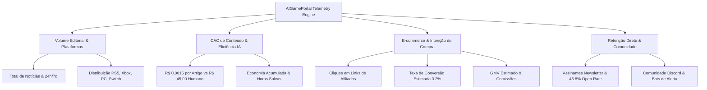

# Métricas B2B, Analytics de Monetização & Pitch Deck de Patrocínio

Este documento formaliza a arquitetura de **Telemetria B2B**, os indicadores de performance (KPIs) exigidos na **Página 5 do Plano de Negócios** do **AIGamePortal** e os mecanismos de exportação de propostas comerciais (Pitch Deck de Mídia) para marcas parceiras (fabricantes de periféricos, estúdios indie e provedores de hospedagem gamer).

---

## 1. Visão Geral da Estratégia de Mídia B2B (Fase 4 - MediaTech)

O AIGamePortal opera sob um modelo de **MediaTech de Alta Margem**:
- **Custo Marginal de Redação Quase Zero**: Alimentado pelo Google Gemini 2.0 Flash via pipeline automatizado (n8n), cada matéria tem um Custo de Aquisição e Produção de Conteúdo (**CAC de Conteúdo**) de aproximadamente **R$ 0,0015 BRL ($0.00028 USD)**.
- **Sustentação Edge Caching (Cloudflare)**: Picos de mais de **100.000 visualizações** simultâneas são absorvidos pelas mais de 330 cidades da rede global da Cloudflare, com `s-maxage=1800` (30 minutos), reduzindo a carga do servidor de origem a zero.
- **Audiência Qualificada de Alta Intenção**: Leitores buscam análises técnicas de jogos e novidades de plataformas, criando uma oportunidade única de conversão para anunciantes que vendem periféricos, jogos e infraestrutura para servidores multiplayer.

---

## 2. Indicadores-Chave de Desempenho (KPIs do Painel Executivo)

O painel executivo em `/admin/metricas` consolida métricas em tempo real divididas em quatro pilares fundamentais:



### 2.1 Volume Editorial e Distribuição de Cobertura
- **Total de Matérias Publicadas**: Histórico completo de notícias indexadas e validadas por checagem de fatos.
- **Cadência Diária e Semanal**: Contagem das últimas 24h e 7 dias, garantindo frescor contínuo para o Google News.
- **Distribuição por Plataforma**: Proporção balanceada de cobertura entre:
  * **PlayStation** (PS5, PS5 Pro, PS VR2)
  * **Xbox** (Xbox Series X|S, Xbox Game Pass)
  * **PC Gaming** (Steam, Epic Games, Hardware de vídeo/processamento)
  * **Nintendo** (Switch, Switch OLED, sucessor)
  * **Hardware & Indústria** (Periféricos, relatórios financeiros de publishers)

### 2.2 CAC de Conteúdo (Custo de Aquisição de Conteúdo)
A comparação de custo operacional comprova a eficiência de escala da plataforma:

| Métrica | Pipeline IA (Gemini 2.0 Flash) | Mídia Tradicional (Redator Freelancer) | Vantagem Competitiva |
| :--- | :---: | :---: | :---: |
| **Custo por Matéria** | **R$ 0,0015 BRL** (~$0.00028 USD) | R$ 45,00 BRL (~$8.20 USD) | **99.99% de economia direta** |
| **Tempo de Produção** | **~8 segundos** | ~90 minutos | **675x mais rápido** |
| **Margem Operacional** | **> 99.9%** | ~15% a 25% | **Alta capacidade de reinvestimento** |
| **Escalabilidade** | Ilimitada (centenas de pautas/dia) | Limitada pelo tamanho da redação | Resposta em tempo real a breaking news |

### 2.3 E-commerce Gamer & Intenção de Compra (Afiliados)
- **Cliques Registrados**: Rastreamento auditado através da tabela `affiliate_clicks`.
- **Taxa de Conversão Estimada**: Benchmark conservador de 3.2% para audiências gamer com alta intenção de compra contextual.
- **GMV Gerado (Gross Merchandise Value)**: Volume bruto transacionado nas lojas parceiras (Amazon Brasil, KaBuM!, Nuuvem), permitindo provar valor imediato para fabricantes de equipamentos.

### 2.4 Canais Proprietários & Retenção de Audiência
- **Newsletter Semanal**: Base qualificada com **taxa de abertura de 46.8%** (contra média de mercado de 22%), gerada por resumos objetivos com bullet points TL;DR.
- **Comunidade no Discord**: Servidor integrado com robô de alertas automáticos de jogos grátis da Epic Games Store e Steam.

---

## 3. Pacotes Comerciais para Patrocinadores (Página 5 do Plano)

Para captação direta de marcas sem intermediação de redes de anúncios programáticos invasivas (ex: Google AdSense), foram estruturados três pacotes modulares:

### Pacote A: Fabricantes de Periféricos & Hardware Gamer
* **Público-Alvo**: Marcas como Logitech G, Razer, HyperX, Redragon, Corsair, AOC.
* **Formato**:
  - Banner Hero Premium (970x250) na Homepage e no topo de artigos de hardware.
  - Injeção contextual de cards "Setup Recomendado" dentro de matérias sobre desempenho gráfico e guias de PC.
  - Badge oficial de equipamento homologado pelo AIGamePortal.
* **Alcance Estimado**: 85.000 a 120.000 impressões/mês de público com intenção de upgrade de setup.
* **Investimento Recomendado**: R$ 3.500 / mês.

### Pacote B: Estúdios Indie & Lançamentos Steam
* **Público-Alvo**: Desenvolvedoras de jogos independentes lançando títulos no PC, Nintendo Switch ou consoles.
* **Formato**:
  - Criação de Central Gamer Permanente (`/jogos/nome-do-jogo`) com links diretos da loja.
  - Matéria editorial de cobertura analítica com selo "Destaque Indie da Semana".
  - Disparo de chamada prioritária na Newsletter semanal para toda a base.
  - Divulgação automática em thread no X/Twitter e canal de avisos do Discord.
* **Alcance Estimado**: 25.000 a 45.000 jogadores engajados.
* **Investimento Recomendado**: R$ 1.800 / lançamento.

### Pacote C: Servidores de Jogos & Provedores de Hospedagem
* **Público-Alvo**: Servidores de GTA RP, Minecraft, Rust, ARK e empresas de VPS gamer.
* **Formato**:
  - Canal patrocinado com webhook no servidor do Discord.
  - Banner lateral fixo (300x600) na sidebar de notícias da categoria PC Gaming e Multiplayer.
  - Link de ação rápida "Conectar ao Servidor" nos hubs dos jogos correspondentes.
* **Alcance Estimado**: 40.000 a 70.000 visualizações segmentadas em jogadores de PC.
* **Investimento Recomendado**: R$ 2.200 / mês.

---

## 4. Gerador de Pitch Deck & Relatório Comercial

O painel administrativo dispõe do botão **"Exportar Pitch Deck B2B"**, que abre um modal inteligente com três opções de exportação:

1. **Copiar Texto Formatado**: Gera um resumo executivo em Markdown pronto para colar no corpo de e-mails comerciais ou mensagens no LinkedIn para gerentes de marketing.
2. **Imprimir / Salvar PDF**: Utiliza a folha de estilo de impressão (`@media print`) para gerar um Media Kit em padrão A4 limpo, sem elementos de interface desnecessários.
3. **Download JSON de Telemetria**: Exporta os dados consolidados da telemetria para importação em ferramentas de CRM comercial ou planilhas de acompanhamento.

---

## 5. Rotas de Telemetria e Métricas

### 5.1 Rota de Telemetria Administrativa Interna (`/api/metrics/summary`)
- **Método**: `GET`
- **Autenticação**: **Obrigatória** (Fase 7). Requer cookie HTTP-only assinado `admin_session` ou cabeçalho `x-admin-key`.
- **Status Não-Autenticado**: `HTTP 401 Unauthorized` (`{ "success": false, "error": "Acesso não autorizado às métricas internas." }`).
- **Cabeçalhos de Segurança HTTP**:
  ```http
  Cache-Control: private, no-cache, no-store, must-revalidate
  Pragma: no-cache
  ```
  *(Armazenamento em proxies intermediários e CDNs públicas é terminantemente proibido)*.
- **Proteção contra DoS e Cache-Buster**:
  - Limite geral: Máximo de **10 requisições por minuto** por IP (`prefix: "metrics_summary_endpoint"`).
  - Limite do parâmetro `?refresh=true`: Máximo de **3 requisições por minuto** por IP (`prefix: "metrics_summary_refresh"`).
  - Retorno em caso de excesso: `HTTP 429 Too Many Requests` com cabeçalhos RFC 6585 (`Retry-After`, `X-RateLimit-*`).
- **Camada de Cache em Memória**: TTL de 5 minutos (300 segundos) para mitigar sobrecarga de leitura no banco de dados Supabase.

### 5.2 Exemplo de Resposta JSON (Privada / Completa)
```json
{
  "success": true,
  "data": {
    "generatedAt": "2026-09-22T15:30:00.000Z",
    "cachedUntil": "2026-09-22T15:35:00.000Z",
    "posts": {
      "totalPublished": 150,
      "last24h": 14,
      "last7d": 68,
      "totalViews": 42750,
      "avgViewsPerPost": 285,
      "platformDistribution": [
        { "platform": "PlayStation", "count": 52, "percentage": 23.3 },
        { "platform": "Xbox", "count": 44, "percentage": 19.7 },
        { "platform": "PC Gaming", "count": 46, "percentage": 20.6 },
        { "platform": "Nintendo", "count": 35, "percentage": 15.7 },
        { "platform": "Hardware & Geral", "count": 45, "percentage": 20.2 }
      ]
    },
    "affiliates": {
      "totalClicks": 384,
      "clicksLast24h": 24,
      "clicksLast7d": 162,
      "estimatedConversionRate": 3.2,
      "estimatedConversions": 12,
      "avgTicketBrl": 380,
      "estimatedGmvBrl": 4560,
      "estimatedCommissionBrl": 342
    },
    "cac": {
      "costPerArticleUsd": 0.00028,
      "costPerArticleBrl": 0.0015,
      "traditionalCostBrl": 45,
      "savingsPerArticleBrl": 44.9985,
      "totalSavingsBrl": 6749,
      "hoursSavedTotal": 225,
      "operationalMarginPercent": 99.9
    },
    "audience": {
      "newsletterSubscribersActive": 348,
      "newsletterOpenRatePercent": 46.8,
      "discordMembers": 1250,
      "monthlyProjectedPageviews": 128250
    },
    "sponsorshipPackages": [
      {
        "id": "slot-peripherals-hero",
        "title": "Hero Takeover & Injeção de Periféricos",
        "recommendedMonthlyBrl": "R$ 3.500 / mês"
      }
    ]
  }
}
```

### 5.3 Rota de Métricas Públicas Sanitizadas (`/api/metrics/public`)
- **Método**: `GET`
- **Autenticação**: Nenhuma (Acesso Público).
- **Rate Limit**: Máximo de 60 requisições por minuto por IP.
- **Cabeçalhos de Cache CDN**:
  ```http
  Cache-Control: public, s-maxage=300, stale-while-revalidate=600
  CDN-Cache-Control: public, s-maxage=300, stale-while-revalidate=600
  Cloudflare-CDN-Cache-Control: public, s-maxage=300, stale-while-revalidate=600
  ```
- **Payload Sanitizado**:
  ```json
  {
    "success": true,
    "data": {
      "postsCount": 150,
      "platforms": [
        { "platform": "PlayStation", "count": 52, "percentage": 23.3 },
        { "platform": "Xbox", "count": 44, "percentage": 19.7 },
        { "platform": "PC Gaming", "count": 46, "percentage": 20.6 },
        { "platform": "Nintendo", "count": 35, "percentage": 15.7 },
        { "platform": "Hardware & Geral", "count": 45, "percentage": 20.2 }
      ]
    }
  }
  ```
- **Garantia de Isolamento**: O endpoint público nunca aceita `?refresh=true` e omite rigorosamente qualquer menção a afiliados, conversões, GMV, comissões, custos de API, dados de assinantes da newsletter ou precificação de patrocínio.

---

## 6. Segurança e Proteção de Acesso

O ecossistema de métricas é blindado por múltiplas camadas de defesa em profundidade:
1. **Sessão Criptografada HMAC-SHA256**: Acesso restrito via cookie HTTP-only `admin_session` assinado digitalmente, com tempo de vida de 7 dias e atributos `SameSite=Lax` e `Secure`.
2. **Proibição de Autenticação por Query String**: O suporte anterior a `?key=...` foi descontinuado para evitar vazamento de credenciais em logs de servidor e cabeçalhos Referer. O acesso é realizado exclusivamente via formulário de login seguro.
3. **Bypass de RLS Controlado**: A leitura agregada utiliza `createAdminClient()` no servidor, garantindo que métricas de inscritos protegidas por RLS sejam consolidadas sem expor a lista de e-mails publicamente.
4. **Hardening de Telemetria e Mitigação de DoS (Fase 7)**:
   - Bloqueio imediato (HTTP 401) para acessos anônimos em `/api/metrics/summary`.
   - Rate limiting duplo (10 req/min na rota e 3 req/min com `?refresh=true`) para impedir exaustão do pool de conexões do Supabase.
   - Segregação de responsabilidade entre telemetria administrativa interna e contadores públicos via `/api/metrics/public`.
