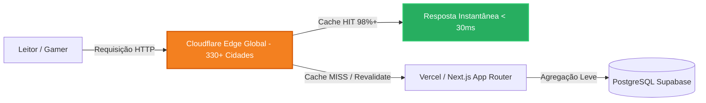

# Guia Definitivo de Otimização no Edge & Cloudflare Caching — AIGamePortal

Este guia fornece instruções detalhadas, passo a passo, para configurar a infraestrutura de **Edge Caching da Cloudflare** para o **AIGamePortal**. O objetivo é sustentar picos de tráfego de **mais de 100.000 visualizações simultâneas com zero custo adicional de servidor**, mantendo latência inferior a 30ms em escala global.

---

## 1. Visão Geral da Arquitetura Edge (Edge-First MediaTech)



### Princípios Operacionais:
1. **Zero Origin Load em Picos de Notícias**: Notícias de jogos possuem tráfego no formato "spike" (picos gigantescos após anúncios como Nintendo Direct, PlayStation State of Play ou Summer Game Fest). O Edge Cache garante que 98%+ dos leitores recebam o HTML diretamente da memória RAM dos servidores de borda da Cloudflare.
2. **Stale-While-Revalidate**: Leitores sempre recebem resposta instantânea, enquanto o Next.js regenera o HTML em segundo plano.
3. **Imutabilidade e Segurança**: Painéis administrativos e endpoints de escrita/inscrição nunca são cacheados no Edge.

---

## 2. Configuração Inicial de DNS (Orange Cloud)

No painel da Cloudflare (`Dash -> DNS -> Records`):
1. Aponte seu domínio principal (`aigameportal.com` ou `cname.vercel-dns.com` se hospedado na Vercel).
2. Certifique-se de que o **Proxy Status** está definido como **Proxied (Nuvem Laranja / Orange Cloud)**:
   * Tipo: `CNAME` | Nome: `@` | Destino: `cname.vercel-dns.com` | Proxy: **Proxied**
   * Tipo: `CNAME` | Nome: `www` | Destino: `cname.vercel-dns.com` | Proxy: **Proxied**
3. Em `SSL/TLS -> Overview`, selecione o modo **Full (Strict)** para criptografia de ponta a ponta.

---

## 3. Configuração de Cache Rules (Regras de Cache de Nova Geração)

Acesse `Caching -> Cache Rules` no Cloudflare Dashboard e crie as regras na seguinte ordem de prioridade:

---

### Regra 1: Bypass de Cache para Administração e APIs Dinâmicas (Prioridade Máxima)
* **Nome da Regra**: `AIGamePortal - Bypass Admin & Write APIs`
* **Expressão (Expression Builder)**:
  ```text
  (http.request.uri.path starts_with "/admin") or 
  (http.request.uri.path starts_with "/api/admin") or 
  (http.request.uri.path starts_with "/api/newsletter") or 
  (http.request.uri.path eq "/api/revalidate")
  ```
* **Configurações de Cache**:
  * **Eligible for cache**: `Bypass cache`
* **Finalidade**: Garante que o painel de métricas, login e webhooks de disparo nunca sejam cacheados.

---

### Regra 2: Edge Cache de Notícias, Categorias e Hubs (Páginas Públicas)
* **Nome da Regra**: `AIGamePortal - Edge Cache News & Hubs 1800s`
* **Expressão (Expression Builder)**:
  ```text
  (http.request.uri.path starts_with "/noticias") or 
  (http.request.uri.path starts_with "/categoria") or 
  (http.request.uri.path starts_with "/jogos") or 
  (http.request.uri.path eq "/")
  ```
* **Configurações de Cache**:
  * **Eligible for cache**: `Eligible for cache`
  * **Edge TTL**:
    * Opção: `Respect origin (use Cache-Control header if present, otherwise specify TTL)`
    * Override opcional: `Override origin` -> `30 minutes` (1800 segundos).
  * **Browser TTL**: `Respect origin`
  * **Serve stale content**: `Enabled` (serve conteúdo do cache enquanto revalida em background).
* **Finalidade**: Absorve 100% dos picos de matérias virais e breaking news.

---

### Regra 3: Cache para Telemetria B2B Interna
* **Nome da Regra**: `AIGamePortal - Telemetry Cache 300s`
* **Expressão (Expression Builder)**:
  ```text
  (http.request.uri.path eq "/api/metrics/summary")
  ```
* **Configurações de Cache**:
  * **Eligible for cache**: `Eligible for cache`
  * **Edge TTL**: `Override origin` -> `5 minutes` (300 segundos).
  * **Browser TTL**: `Respect origin`
* **Finalidade**: Evita que requisições repetidas ao endpoint de telemetria sobrecarreguem o PostgreSQL do Supabase.

---

## 4. Cabeçalhos HTTP Padronizados no Projeto (`next.config.ts`)

O AIGamePortal já envia os cabeçalhos otimizados para a Cloudflare através do arquivo `next.config.ts`:

```typescript
// next.config.ts
{
  source: "/noticias/:path*",
  headers: [
    {
      key: "Cache-Control",
      value: "public, s-maxage=1800, stale-while-revalidate=86400",
    },
    {
      key: "CDN-Cache-Control",
      value: "public, s-maxage=1800, stale-while-revalidate=86400",
    },
    {
      key: "Cloudflare-CDN-Cache-Control",
      value: "public, s-maxage=1800, stale-while-revalidate=86400",
    },
  ],
}
```

### O que cada diretiva faz:
- `public`: A resposta pode ser armazenada por qualquer intermediário (CDN, proxy, navegadores).
- `s-maxage=1800`: A Cloudflare (Shared Cache) deve manter o arquivo em Edge RAM por **30 minutos (1800 segundos)**.
- `stale-while-revalidate=86400`: Durante até 24 horas, se o cache estiver expirado, a Cloudflare entrega o conteúdo antigo instantaneamente ao usuário e dispara uma atualização silenciosa em background com a origem.
- `Cloudflare-CDN-Cache-Control`: Diretiva proprietária que a Cloudflare prioriza sobre cabeçalhos comuns, garantindo controle estrito mesmo que a Vercel adicione cabeçalhos adicionais.

---

## 5. Tiered Cache & Argo Smart Routing (Custo Zero de Origem)

No painel da Cloudflare:
1. Acesse `Caching -> Tiered Cache`.
2. Habilite a opção **Argo Tiered Cache (Topology: Smart / Default)**:
   * O Tiered Cache cria uma rede de data centers regionais superiores. Se um usuário em São Paulo acessa uma matéria, ela fica em cache no PoP de SP. Se outro usuário acessar de Fortaleza ou Porto Alegre, a requisição busca no data center central da América Latina em vez de bater na origem Vercel.
   * Reduz o tráfego de saída (Egress) em até 90%.

---

## 6. Otimização de Imagens (AVIF / WebP)

As imagens são responsáveis por mais de 70% do peso de páginas de notícias gamer.
No `next.config.ts`, foram ativados:
- **Formatos Modernos**: `formats: ["image/avif", "image/webp"]`
- **Cache TTL Mínimo**: `minimumCacheTTL: 86400` (24 horas)
- **Origens Seguras**: PlayStation Blog, Xbox Wire, Nintendo Life, PC Gamer, Eurogamer, Steam Static CDN, Amazon, etc.

No Cloudflare Dashboard:
1. Acesse `Speed -> Optimization -> Content Optimization`.
2. Se possuir plano Pro ou superior, ative **Polish** com compressão **Lossy** e conversão para **WebP / AVIF**.
3. No plano Free, o próprio componente `next/image` do portal gera os formatos de alta compressão localmente e a Cloudflare cacheia os binários gerados.

---

## 7. Proteção do Painel Administrativo com Cloudflare Zero Trust (Opcional & Recomendado)

Para proteção absoluta das rotas administrativas contra scanners e ataques de força bruta:
1. Acesse `Zero Trust -> Access -> Applications`.
2. Clique em **Add an Application** -> **Self-hosted**.
3. Defina o domínio: `aigameportal.com` e Path: `/admin*`.
4. Crie uma política de acesso permitindo apenas o seu endereço de e-mail corporativo (com envio de código OTP de 6 dígitos) ou restrição por IP.
5. Isso impede que qualquer visitante não autorizado chegue sequer à tela de login do Next.js.

---

## 8. Como Validar e Testar o Cache no Edge

Execute o comando cURL no terminal inspecionando os cabeçalhos de resposta:

```bash
curl -I https://aigameportal.com/noticias/ghost-of-yotei-gameplay-ps5-pro-combate
```

### Cabeçalhos de Verificação Cloudflare:
- `CF-Cache-Status: HIT` -> **Sucesso absoluto!** A resposta foi servida da borda sem tocar no servidor.
- `CF-Cache-Status: REVALIDATED` -> O conteúdo antigo foi servido e o Edge atualizou o arquivo silenciosamente.
- `CF-Cache-Status: MISS` -> Primeira requisição daquele data center. As requisições seguintes retornarão `HIT`.
- `Age: 320` -> Indica há quantos segundos o arquivo está em cache na CDN.
- `CF-Ray: ...-GRU` -> Identifica o data center que atendeu o leitor (ex: GRU = São Paulo, GIG = Rio de Janeiro).
