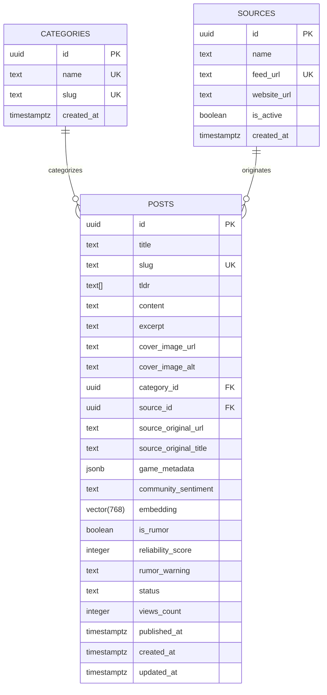

# Documentação de Banco de Dados — AIGamePortal (Fase 1 - MVP)

Esta documentação detalha a arquitetura de dados, modelagem, estratégias de indexação vetorial e relacional, políticas de segurança (RLS) e funções RPC do **AIGamePortal**, projetadas para execução no PostgreSQL com **Supabase** e integração com automações de IA (n8n + Google Gemini).

---

## 1. Diagrama Entidade-Relacionamento (ERD)



---

## 2. Dicionário de Dados

### 2.1 Tabela `public.categories`

Armazena as plataformas e editorias do portal.

| Coluna | Tipo | Modificadores | Descrição |
| :--- | :--- | :--- | :--- |
| `id` | `UUID` | `PRIMARY KEY DEFAULT gen_random_uuid()` | Identificador único |
| `name` | `TEXT` | `NOT NULL UNIQUE` | Nome legível (ex: *PlayStation*, *PC Gaming*) |
| `slug` | `TEXT` | `NOT NULL UNIQUE` | Slug amigável para rotas (ex: `playstation`, `pc-gaming`) |
| `created_at` | `TIMESTAMPTZ` | `NOT NULL DEFAULT now()` | Registro de criação |

---

### 2.2 Tabela `public.sources`

Armazena os canais e feeds RSS monitorados pelo pipeline automatizado.

| Coluna | Tipo | Modificadores | Descrição |
| :--- | :--- | :--- | :--- |
| `id` | `UUID` | `PRIMARY KEY DEFAULT gen_random_uuid()` | Identificador único |
| `name` | `TEXT` | `NOT NULL` | Nome do veículo (ex: *PlayStation Blog*, *PC Gamer*) |
| `feed_url` | `TEXT` | `NOT NULL UNIQUE` | URL do endpoint RSS/Atom |
| `website_url` | `TEXT` | `NULL` | Domínio raiz da fonte |
| `is_active` | `BOOLEAN` | `NOT NULL DEFAULT true` | Flag para pausar/ativar scraping no n8n |
| `created_at` | `TIMESTAMPTZ` | `NOT NULL DEFAULT now()` | Data de cadastro da fonte |

---

### 2.3 Tabela `public.posts`

Entidade central contendo o conteúdo das matérias geradas e estruturadas por IA.

| Coluna | Tipo | Modificadores | Descrição |
| :--- | :--- | :--- | :--- |
| `id` | `UUID` | `PRIMARY KEY DEFAULT gen_random_uuid()` | Identificador único |
| `title` | `TEXT` | `NOT NULL` | Título otimizado para CTR e SEO |
| `slug` | `TEXT` | `NOT NULL UNIQUE` | URL amigável única |
| `tldr` | `TEXT[]` | `NOT NULL DEFAULT '{}'::TEXT[]` | 3 a 4 bullet points resumindo a notícia |
| `content` | `TEXT` | `NOT NULL` | Conteúdo integral em Markdown rico |
| `excerpt` | `TEXT` | `NULL` | Meta description (150-160 caracteres) |
| `cover_image_url` | `TEXT` | `NULL` | Imagem destacada de capa |
| `cover_image_alt` | `TEXT` | `NULL` | Texto alternativo para acessibilidade e SEO |
| `category_id` | `UUID` | `FK -> categories.id ON DELETE SET NULL` | Categoria primária |
| `source_id` | `UUID` | `FK -> sources.id ON DELETE SET NULL` | Fonte originária |
| `source_original_url` | `TEXT` | `NOT NULL` | URL original para conformidade E-E-A-T |
| `source_original_title` | `TEXT` | `NULL` | Título original capturado do feed |
| `game_metadata` | `JSONB` | `NOT NULL DEFAULT '{}'::JSONB` | Dados estruturados do jogo (ver esquema abaixo) |
| `community_sentiment` | `TEXT` | `NULL` | Reação pública resumida (Reddit/X/fóruns) |
| `embedding` | `vector(768)`| `NULL` | Vetor denso (Gemini `text-embedding-004`) |
| `is_rumor` | `BOOLEAN` | `NOT NULL DEFAULT false` | Flag indicando se a matéria é rumor, vazamento ou patente |
| `reliability_score` | `INTEGER` | `NOT NULL DEFAULT 5 CHECK (1 a 5)` | Escala de confiabilidade: 5 (anúncio oficial) a 1 (fórum anônimo) |
| `rumor_warning` | `TEXT` | `NULL` | Aviso explicativo e contextual gerado pelo agente de IA |
| `status` | `TEXT` | `NOT NULL DEFAULT 'published'` | `CHECK (status IN ('draft', 'published', 'archived'))` |
| `views_count` | `INTEGER` | `NOT NULL DEFAULT 0` | Contador de visualizações |
| `published_at` | `TIMESTAMPTZ` | `NOT NULL DEFAULT now()` | Data de publicação visível |
| `created_at` | `TIMESTAMPTZ` | `NOT NULL DEFAULT now()` | Criação no banco |
| `updated_at` | `TIMESTAMPTZ` | `NOT NULL DEFAULT now()` | Atualização (gerido via trigger automático) |

#### Estrutura do `game_metadata` (JSONB)
```json
{
  "game_name": "Ghost of Yōtei",
  "platforms": ["PlayStation 5"],
  "metacritic_score": null,
  "release_date": "2025-10-15",
  "developer": "Sucker Punch Productions",
  "publisher": "Sony Interactive Entertainment"
}
```

---

## 3. Estratégia de Indexação e Performance

| Nome do Índice | Tipo | Tabela / Colunas | Justificativa |
| :--- | :--- | :--- | :--- |
| `idx_posts_slug` | B-Tree | `posts(slug)` | Resolução de rotas dinâmicas `/noticias/[slug]` em $O(\log N)$ |
| `idx_posts_published_at_desc` | B-Tree | `posts(published_at DESC)` | Paginação e ordenação cronológica do feed inicial |
| `idx_posts_category_id` | B-Tree | `posts(category_id)` | Filtragem de notícias por categoria |
| `idx_posts_source_id` | B-Tree | `posts(source_id)` | Agrupamento e auditoria por veículo de origem |
| `idx_posts_is_rumor` | B-Tree | `posts(is_rumor)` | Filtragem rápida para listagens/exclusões de boatos |
| `idx_posts_reliability_score` | B-Tree | `posts(reliability_score)` | Auditoria editorial e ordenação por reputação de fonte |
| `idx_posts_status_published_at` | B-Tree Composto | `posts(status, published_at DESC)` | Garante index-only scans para queries públicas |
| `idx_posts_source_original_url` | B-Tree | `posts(source_original_url)` | Deduplicação determinística no n8n antes do embedding |
| `idx_posts_embedding_hnsw` | HNSW (`vector_cosine_ops`) | `posts(embedding)` | Busca por vizinhos mais próximos (ANN) com distância de cosseno |

### Por que HNSW em vez de IVFFlat?
1. **Sem necessidade de retreino:** O IVFFlat necessita que a tabela já contenha centenas de registros para construir listas de Voronoi eficazes e perde precisão conforme novos dados entram sem `REINDEX`.
2. **Alta Precisão (Recall):** HNSW (`m = 16, ef_construction = 64`) oferece recall superior a 95% para buscas de deduplicação semântica mesmo em tabelas em crescimento contínuo.

---

## 4. Deduplicação Semântica com IA (`match_recent_articles`)

A função RPC `public.match_recent_articles` compara o embedding da notícia recém-capturada com o acervo publicado nas últimas `hours_limit` horas (ex: 48h):

```sql
CREATE OR REPLACE FUNCTION public.match_recent_articles(
    query_embedding vector(768),
    match_threshold float DEFAULT 0.82,
    hours_limit int DEFAULT 48
)
RETURNS TABLE (
    id UUID,
    title TEXT,
    slug TEXT,
    similarity FLOAT,
    published_at TIMESTAMPTZ,
    source_original_url TEXT
)
LANGUAGE plpgsql
STABLE
SECURITY DEFINER
SET search_path = public
AS $$
BEGIN
    RETURN QUERY
    SELECT
        p.id,
        p.title,
        p.slug,
        (1 - (p.embedding <=> query_embedding))::FLOAT AS similarity,
        p.published_at,
        p.source_original_url
    FROM public.posts p
    WHERE p.published_at >= (now() - (hours_limit || ' hours')::INTERVAL)
      AND p.embedding IS NOT NULL
      AND (1 - (p.embedding <=> query_embedding)) >= match_threshold
    ORDER BY similarity DESC;
END;
$$;
```

### Como chamar via Supabase Client (Javascript/TypeScript)
```typescript
const { data: matches, error } = await supabase.rpc('match_recent_articles', {
  query_embedding: geminiEmbeddingVector, // Array de 768 floats
  match_threshold: 0.82,
  hours_limit: 48
});

if (matches && matches.length > 0) {
  console.log(`Notícia duplicada encontrada! Similaridade: ${matches[0].similarity}`);
  // Aborta inserção ou enriquece o post existente
}
```

---

## 5. Políticas de Segurança (Row Level Security - RLS)

Todas as tabelas possuem `ENABLE ROW LEVEL SECURITY`.

1. **`public.categories`**:
   - `SELECT`: Liberado para perfis `anon` e `authenticated` (leitura pública para renderização do site).
   - `ALL`: Restrito a `service_role` (inserção e alteração via scripts e pipeline).
2. **`public.sources`**:
   - `SELECT`: Liberado para `anon` e `authenticated` apenas quando `is_active = true`.
   - `ALL`: Restrito a `service_role`.
3. **`public.posts`**:
   - `SELECT`: Liberado para `anon` e `authenticated` **estritamente onde `status = 'published'`**. Rascunhos (`draft`) e arquivados (`archived`) são invisíveis publicamente.
   - `ALL`: Restrito a `service_role` (usado com chave secreta no n8n para CRUD completo).
