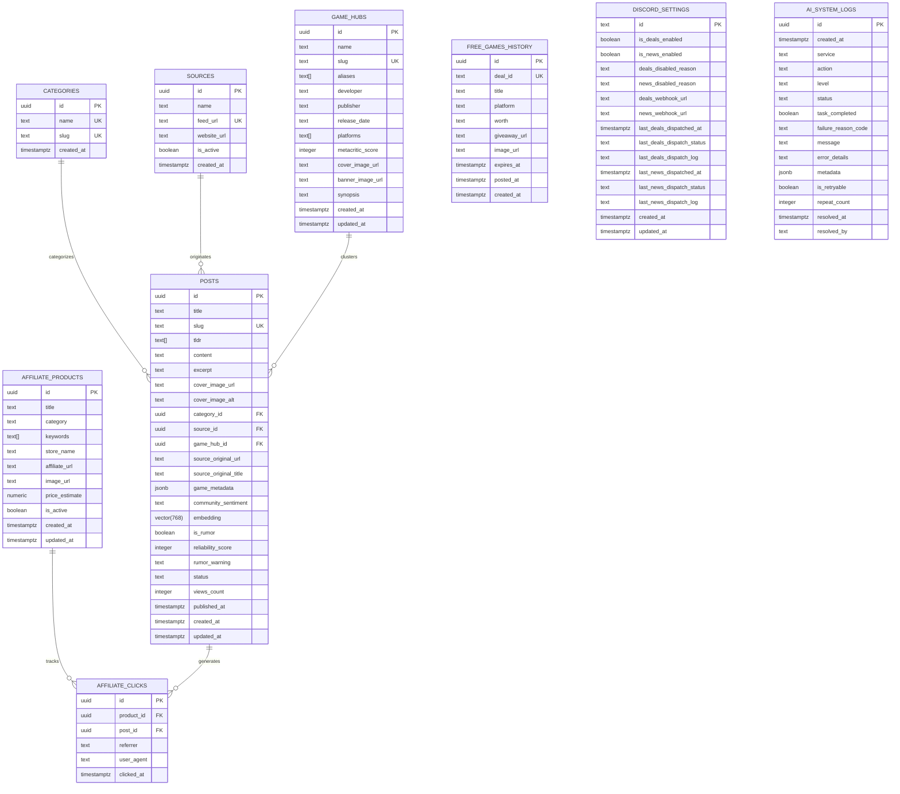

# Documentação de Banco de Dados — AIGamePortal (Fase 1 - MVP)

Esta documentação detalha a arquitetura de dados, modelagem, estratégias de indexação vetorial e relacional, políticas de segurança (RLS) e funções RPC do **AIGamePortal**, projetadas para execução no PostgreSQL com **Supabase** e integração com automações de IA (n8n + Google Gemini).

---

## 1. Diagrama Entidade-Relacionamento (ERD)



---

## 2. Dicionário de Dados

### 2.1 Tabela `public.categories`

Armazena as plataformas e editorias do portal.

| Coluna | Tipo | Modificadores | Descrição |
| :--- | :--- | :--- | :--- |
| `id` | `UUID` | `PRIMARY KEY DEFAULT gen_random_uuid()` | Identificador único |
| `name` | `TEXT` | `NOT NULL UNIQUE` | Nome legível (ex: *PlayStation*, *PC Gaming*) |
| `slug` | `TEXT` | `NOT NULL UNIQUE` | Slug amigável para rotas (ex: `playstation`, `pc-gaming`) |
| `created_at` | `TIMESTAMPTZ` | `NOT NULL DEFAULT now()` | Registro de criação |

---

### 2.2 Tabela `public.sources`

Armazena os canais e feeds RSS/Atom monitorados pelo pipeline automatizado, categorizados pelo sistema de autoridade Multi-Tier:
- **Tier 1 (Fontes Primárias & Lojas Oficiais)**: *PlayStation Blog*, *Xbox Wire*, *Nintendo Everything*, *Nintendo Life*, *Steam News*, *Games Press*.
- **Tier 2 (Jornalismo Internacional Especializado)**: *VGC (Video Games Chronicle)*, *Eurogamer*, *Gematsu*, *PC Gamer*, *Rock Paper Shotgun*, *Destructoid*, *GamesIndustry.biz*.
- **Tier 3 (Comunidades Auditadas com Moderação)**: *r/Games*, *r/GamingLeaksAndRumours*.

| Coluna | Tipo | Modificadores | Descrição |
| :--- | :--- | :--- | :--- |
| `id` | `UUID` | `PRIMARY KEY DEFAULT gen_random_uuid()` | Identificador único |
| `name` | `TEXT` | `NOT NULL` | Nome do veículo (ex: *VGC*, *Steam News*, *r/Games*) |
| `feed_url` | `TEXT` | `NOT NULL UNIQUE` | URL do endpoint RSS/Atom |
| `website_url` | `TEXT` | `NULL` | Domínio raiz da fonte |
| `is_active` | `BOOLEAN` | `NOT NULL DEFAULT true` | Flag para pausar/ativar scraping no pipeline |
| `created_at` | `TIMESTAMPTZ` | `NOT NULL DEFAULT now()` | Data de cadastro da fonte |


---

### 2.3 Tabela `public.posts`

Entidade central contendo o conteúdo das matérias geradas e estruturadas por IA.

| Coluna | Tipo | Modificadores | Descrição |
| :--- | :--- | :--- | :--- |
| `id` | `UUID` | `PRIMARY KEY DEFAULT gen_random_uuid()` | Identificador único |
| `title` | `TEXT` | `NOT NULL` | Título otimizado para CTR e SEO |
| `slug` | `TEXT` | `NOT NULL UNIQUE` | URL amigável única |
| `tldr` | `TEXT[]` | `NOT NULL DEFAULT '{}'::TEXT[]` | 3 a 4 bullet points resumindo a notícia |
| `content` | `TEXT` | `NOT NULL` | Conteúdo integral em Markdown rico |
| `excerpt` | `TEXT` | `NULL` | Meta description (150-160 caracteres) |
| `cover_image_url` | `TEXT` | `NULL` | Imagem destacada de capa |
| `cover_image_alt` | `TEXT` | `NULL` | Texto alternativo para acessibilidade e SEO |
| `category_id` | `UUID` | `FK -> categories.id ON DELETE SET NULL` | Categoria primária |
| `source_id` | `UUID` | `FK -> sources.id ON DELETE SET NULL` | Fonte originária |
| `source_original_url` | `TEXT` | `NOT NULL` | URL original para conformidade E-E-A-T |
| `source_original_title` | `TEXT` | `NULL` | Título original capturado do feed |
| `game_metadata` | `JSONB` | `NOT NULL DEFAULT '{}'::JSONB` | Dados estruturados do jogo (ver esquema abaixo) |
| `community_sentiment` | `TEXT` | `NULL` | Reação pública resumida (Reddit/X/fóruns) |
| `embedding` | `vector(768)`| `NULL` | Vetor denso (Gemini `text-embedding-004`) |
| `is_rumor` | `BOOLEAN` | `NOT NULL DEFAULT false` | Flag indicando se a matéria é rumor, vazamento ou patente |
| `reliability_score` | `INTEGER` | `NOT NULL DEFAULT 5 CHECK (1 a 5)` | Escala de confiabilidade: 5 (anúncio oficial) a 1 (fórum anônimo) |
| `rumor_warning` | `TEXT` | `NULL` | Aviso explicativo e contextual gerado pelo agente de IA |
| `status` | `TEXT` | `NOT NULL DEFAULT 'published'` | `CHECK (status IN ('draft', 'published', 'archived'))` |
| `views_count` | `INTEGER` | `NOT NULL DEFAULT 0` | Contador de visualizações |
| `published_at` | `TIMESTAMPTZ` | `NOT NULL DEFAULT now()` | Data de publicação visível |
| `created_at` | `TIMESTAMPTZ` | `NOT NULL DEFAULT now()` | Criação no banco |
| `updated_at` | `TIMESTAMPTZ` | `NOT NULL DEFAULT now()` | Atualização (gerido via trigger automático) |

#### Estrutura do `game_metadata` (JSONB)
```json
{
  "game_name": "Ghost of Yōtei",
  "platforms": ["PlayStation 5"],
  "metacritic_score": null,
  "release_date": "2025-10-15",
  "developer": "Sucker Punch Productions",
  "publisher": "Sony Interactive Entertainment"
}
```

---

### 2.4 Tabela `public.affiliate_products` (Fase 3 - Afiliados)

Catálogo de produtos gamer monitorados para injeção contextual em notícias e exibição no card de recomendação final.

| Coluna | Tipo | Modificadores | Descrição |
| :--- | :--- | :--- | :--- |
| `id` | `UUID` | `PRIMARY KEY DEFAULT gen_random_uuid()` | Identificador único do produto |
| `title` | `TEXT` | `NOT NULL` | Nome completo comercial do produto |
| `category` | `TEXT` | `NOT NULL CHECK ('Hardware', 'Console', 'PC', 'Jogo', 'Acessórios')` | Segmento gamer |
| `keywords` | `TEXT[]` | `NOT NULL DEFAULT '{}'::TEXT[]` | Palavras-chave para casamento contextual no Markdown |
| `store_name` | `TEXT` | `NOT NULL` | Loja parceira (ex: *Amazon Brasil*, *KaBuM!*, *Nuuvem*) |
| `affiliate_url` | `TEXT` | `NOT NULL` | URL de destino com tags de associado do portal |
| `image_url` | `TEXT` | `NOT NULL` | Imagem oficial do produto |
| `price_estimate` | `NUMERIC(10, 2)` | `NULL` | Preço de referência aproximado em BRL |
| `is_active` | `BOOLEAN` | `NOT NULL DEFAULT true` | Flag para ativação/desativação imediata da oferta |
| `created_at` | `TIMESTAMPTZ` | `NOT NULL DEFAULT now()` | Data de cadastro |
| `updated_at` | `TIMESTAMPTZ` | `NOT NULL DEFAULT now()` | Atualização cadastral (via trigger automático) |

---

### 2.5 Tabela `public.affiliate_clicks` (Fase 3 - Afiliados)

Registro analítico de redirecionamentos para mensuração de CTR, conversão por artigo e auditoria de tráfego.

| Coluna | Tipo | Modificadores | Descrição |
| :--- | :--- | :--- | :--- |
| `id` | `UUID` | `PRIMARY KEY DEFAULT gen_random_uuid()` | Identificador único do evento de clique |
| `product_id` | `UUID` | `FK -> affiliate_products.id ON DELETE CASCADE` | Produto clicado |
| `post_id` | `UUID` | `FK -> posts.id ON DELETE SET NULL` | Notícia de onde partiu o clique (se aplicável) |
| `referrer` | `TEXT` | `NULL` | HTTP Referer de origem do usuário |
| `user_agent` | `TEXT` | `NULL` | Navegador e dispositivo do leitor |
| `clicked_at` | `TIMESTAMPTZ` | `NOT NULL DEFAULT now()` | Carimbo de data/hora do redirecionamento |

---

### 2.6 Tabela `public.game_hubs` (Fase 4 - SEO de Cauda Longa)

Centrais e hubs permanentes de jogos para atração de tráfego orgânico perene e auto-clustering editorial de notícias.

| Coluna | Tipo | Modificadores | Descrição |
| :--- | :--- | :--- | :--- |
| `id` | `UUID` | `PRIMARY KEY DEFAULT gen_random_uuid()` | Identificador único do hub |
| `name` | `TEXT` | `NOT NULL` | Nome oficial do título (ex: *Grand Theft Auto VI*) |
| `slug` | `TEXT` | `NOT NULL UNIQUE` | Slug da rota pública `/jogos/[slug]` |
| `aliases` | `TEXT[]` | `NOT NULL DEFAULT '{}'` | Sinônimos e termos de busca para matching |
| `developer` | `TEXT` | `NOT NULL` | Estúdio desenvolvedor |
| `publisher` | `TEXT` | `NOT NULL` | Editora/publicadora |
| `release_date` | `TEXT` | `NOT NULL` | Data ou janela de lançamento |
| `platforms` | `TEXT[]` | `NOT NULL DEFAULT '{}'` | Plataformas confirmadas |
| `metacritic_score`| `INTEGER` | `NULL` | Nota Metacritic oficial (0 a 100) |
| `cover_image_url` | `TEXT` | `NOT NULL` | URL da arte vertical da capa |
| `banner_image_url`| `TEXT` | `NOT NULL` | URL do banner horizontal panorâmico |
| `synopsis` | `TEXT` | `NOT NULL` | Sinopse rica do jogo |
| `created_at` | `TIMESTAMPTZ` | `NOT NULL DEFAULT now()` | Criação cadastral |
| `updated_at` | `TIMESTAMPTZ` | `NOT NULL DEFAULT now()` | Atualização automática via trigger |

---

### 2.7 Tabela `public.free_games_history` (Fase 4 - Bot de Alertas Discord)

Histórico de ofertas de jogos 100% gratuitos disparadas no Discord para prevenção estrita de alertas duplicados.

| Coluna | Tipo | Modificadores | Descrição |
| :--- | :--- | :--- | :--- |
| `id` | `UUID` | `PRIMARY KEY DEFAULT gen_random_uuid()` | Identificador único interno |
| `deal_id` | `TEXT` | `NOT NULL UNIQUE` | ID da promoção fornecido pela API externa (GamerPower) |
| `title` | `TEXT` | `NOT NULL` | Título higienizado do jogo gratuito |
| `platform` | `TEXT` | `NULL` | Plataformas elegíveis (ex: *PC, Steam*, *Epic Games Store*) |
| `worth` | `TEXT` | `NULL` | Valor comercial original antes da gratuidade (ex: *$24.99*) |
| `giveaway_url` | `TEXT` | `NULL` | Link direto para resgate da oferta na loja |
| `image_url` | `TEXT` | `NULL` | Imagem ou banner promocional do jogo em alta definição |
| `expires_at` | `TIMESTAMPTZ` | `NULL` | Data/hora estimada de encerramento da gratuidade |
| `posted_at` | `TIMESTAMPTZ` | `NOT NULL DEFAULT now()` | Data/hora de disparo bem-sucedido no Discord |
| `created_at` | `TIMESTAMPTZ` | `NOT NULL DEFAULT now()` | Registro de auditoria |

---

### 2.8 Tabela `public.discord_settings` (Fase 4 - Painel Administrativo do Discord)

Parâmetros globais de controle, chaves mestras e telemetria dos envios automatizados para o Discord.

| Coluna | Tipo | Modificadores | Descrição |
| :--- | :--- | :--- | :--- |
| `id` | `TEXT` | `PRIMARY KEY DEFAULT 'default'` | Registro único singleton de configuração |
| `is_deals_enabled` | `BOOLEAN` | `NOT NULL DEFAULT false` | Chave mestre de envio de jogos grátis (inicia desabilitado) |
| `is_news_enabled` | `BOOLEAN` | `NOT NULL DEFAULT false` | Chave mestre de envio de breaking news (inicia desabilitado) |
| `deals_disabled_reason` | `TEXT` | `NULL` | Justificativa administrativa para a pausa de jogos grátis |
| `news_disabled_reason` | `TEXT` | `NULL` | Justificativa administrativa para a pausa de breaking news |
| `deals_webhook_url` | `TEXT` | `NULL` | Override opcional de webhook de promoções |
| `news_webhook_url` | `TEXT` | `NULL` | Override opcional de webhook de notícias |
| `last_deals_dispatched_at` | `TIMESTAMPTZ` | `NULL` | Data/hora do último ciclo de checagem/envio de deals |
| `last_deals_dispatch_status` | `TEXT` | `NOT NULL DEFAULT 'idle'` | Status da última execução: `idle`, `success`, `failed` ou `skipped` |
| `last_deals_dispatch_log` | `TEXT` | `NULL` | Resumo textual da última execução do bot de deals |
| `last_news_dispatched_at` | `TIMESTAMPTZ` | `NULL` | Data/hora do último alerta urgente de notícia disparado |
| `last_news_dispatch_status` | `TEXT` | `NOT NULL DEFAULT 'idle'` | Status do último disparo de breaking news |
| `last_news_dispatch_log` | `TEXT` | `NULL` | Resumo textual da última notícia urgente disparada |
| `created_at` | `TIMESTAMPTZ` | `NOT NULL DEFAULT now()` | Criação cadastral |
| `updated_at` | `TIMESTAMPTZ` | `NOT NULL DEFAULT now()` | Atualização automática via trigger |

---

### 2.9 Tabela `public.ai_system_logs` (Fase 1 - Sistema Centralizado de Logs & Auditoria IA)

Tabela centralizada de telemetria, erros e auditoria dos motores de inteligência artificial, raspadores RSS e robôs de redes sociais.

| Coluna | Tipo | Modificadores | Descrição |
| :--- | :--- | :--- | :--- |
| `id` | `UUID` | `PRIMARY KEY DEFAULT gen_random_uuid()` | Identificador universal único do log |
| `created_at` | `TIMESTAMPTZ` | `NOT NULL DEFAULT now()` | Carimbo de data/hora do evento |
| `service` | `TEXT` | `NOT NULL` | Serviço/agente emissor (`ai_writer`, `ai_embedding`, `social_x`, etc.) |
| `action` | `TEXT` | `NOT NULL` | Ação executada (`article_rewrite`, `publish_post`, `vector_search`) |
| `level` | `TEXT` | `NOT NULL CHECK (level IN ('info', 'warn', 'error', 'critical'))` | Severidade do registro |
| `status` | `TEXT` | `NOT NULL CHECK (status IN ('success', 'failed', 'skipped', 'aborted', 'retry_exhausted'))` | Status de conclusão |
| `task_completed` | `BOOLEAN` | `NOT NULL DEFAULT false` | Flag essencial para rastrear se a tarefa esperada foi ou não concluída pela IA |
| `failure_reason_code` | `TEXT` | `NULL` | Código padronizado da causa-raiz (ex: `GEMINI_QUOTA_EXCEEDED`, `TWITTER_CREDITS_DEPLETED`) |
| `message` | `TEXT` | `NOT NULL` | Mensagem descritiva higienizada contra Log Injection (CWE-117) |
| `error_details` | `TEXT` | `NULL CHECK (char_length(error_details) <= 4000)` | Stack trace ou detalhes técnicos truncados e sem segredos (CWE-532) |
| `metadata` | `JSONB` | `NOT NULL DEFAULT '{}'::jsonb` | Metadados estruturados (URLs, tempos de resposta, parâmetros de modelo) |
| `is_retryable` | `BOOLEAN` | `NOT NULL DEFAULT false` | Indica se o erro é transitório e apto a repetição |
| `repeat_count` | `INTEGER` | `NOT NULL DEFAULT 1` | Contador para de-duplicação de erros repetidos no mesmo minuto |
| `resolved_at` | `TIMESTAMPTZ` | `NULL` | Data/hora em que um operador técnico marcou o incidente como solucionado |
| `resolved_by` | `TEXT` | `NULL` | Identificador do usuário/operador que solucionou a ocorrência |

---

## 3. Estratégia de Indexação e Performance

| Nome do Índice | Tipo | Tabela / Colunas | Justificativa |
| :--- | :--- | :--- | :--- |
| `idx_posts_slug` | B-Tree | `posts(slug)` | Resolução de rotas dinâmicas `/noticias/[slug]` em $O(\log N)$ |
| `idx_posts_published_at_desc` | B-Tree | `posts(published_at DESC)` | Paginação e ordenação cronológica do feed inicial |
| `idx_posts_category_id` | B-Tree | `posts(category_id)` | Filtragem de notícias por categoria |
| `idx_posts_source_id` | B-Tree | `posts(source_id)` | Agrupamento e auditoria por veículo de origem |
| `idx_posts_is_rumor` | B-Tree | `posts(is_rumor)` | Filtragem rápida para listagens/exclusões de boatos |
| `idx_posts_reliability_score` | B-Tree | `posts(reliability_score)` | Auditoria editorial e ordenação por reputação de fonte |
| `idx_posts_status_published_at` | B-Tree Composto | `posts(status, published_at DESC)` | Garante index-only scans para queries públicas |
| `idx_posts_source_original_url` | B-Tree | `posts(source_original_url)` | Deduplicação determinística no n8n antes do embedding |
| `idx_posts_embedding_hnsw` | HNSW (`vector_cosine_ops`) | `posts(embedding)` | Busca por vizinhos mais próximos (ANN) com distância de cosseno |
| `idx_affiliate_products_is_active` | B-Tree | `affiliate_products(is_active)` | Busca instantânea de produtos disponíveis para injeção |
| `idx_affiliate_products_keywords` | GIN | `affiliate_products(keywords)` | Busca eficiente de correspondência em arrays de palavras-chave |
| `idx_affiliate_clicks_product_id` | B-Tree | `affiliate_clicks(product_id)` | Agrupamento de cliques por produto para dashboards |
| `idx_affiliate_clicks_post_id` | B-Tree | `affiliate_clicks(post_id)` | Métricas de conversão por artigo |
| `idx_affiliate_clicks_clicked_at` | B-Tree | `affiliate_clicks(clicked_at DESC)` | Análise temporal de conversão e relatórios |
| `idx_posts_game_hub_id` | B-Tree | `posts(game_hub_id)` | Associação rápida de matérias ao hub de jogo |
| `idx_posts_game_hub_published` | B-Tree Composto | `posts(game_hub_id, published_at DESC)` | Consulta instantânea da linha do tempo do hub |
| `idx_game_hubs_slug` | B-Tree | `game_hubs(slug)` | Resolução de rotas dinâmicas `/jogos/[slug]` |
| `idx_game_hubs_aliases` | GIN | `game_hubs(aliases)` | Matching ultrarrápido por array de termos |
| `idx_free_games_history_deal_id` | B-Tree Único | `free_games_history(deal_id)` | Checagem de duplicação de ofertas em tempo constante $O(1)$ |
| `idx_free_games_history_posted_at` | B-Tree | `free_games_history(posted_at DESC)` | Ordenação e relatórios temporais de ofertas |
| `idx_ai_logs_created_at` | B-Tree | `ai_system_logs(created_at DESC)` | Ordenação cronológica para o dashboard e consultas de auditoria |
| `idx_ai_logs_service_status` | B-Tree Composto | `ai_system_logs(service, level, status)` | Filtro rápido por módulo emissor, severidade e status |
| `idx_ai_logs_incomplete_tasks` | B-Tree Parcial | `ai_system_logs(created_at DESC) WHERE task_completed = false` | Índice crucial para localização instantânea de tarefas pendentes |
| `idx_ai_logs_failure_reason` | B-Tree Parcial | `ai_system_logs(failure_reason_code) WHERE failure_reason_code IS NOT NULL` | Agrupamento analítico e computação dos Top Erros nos KPIs |

### Por que HNSW em vez de IVFFlat?
1. **Sem necessidade de retreino:** O IVFFlat necessita que a tabela já contenha centenas de registros para construir listas de Voronoi eficazes e perde precisão conforme novos dados entram sem `REINDEX`.
2. **Alta Precisão (Recall):** HNSW (`m = 16, ef_construction = 64`) oferece recall superior a 95% para buscas de deduplicação semântica mesmo em tabelas em crescimento contínuo.

---

## 4. Deduplicação Semântica com IA (`match_recent_articles`)

A função RPC `public.match_recent_articles` compara o embedding da notícia recém-capturada com o acervo publicado nas últimas `hours_limit` horas (ex: 48h):

```sql
CREATE OR REPLACE FUNCTION public.match_recent_articles(
    query_embedding vector(768),
    match_threshold float DEFAULT 0.82,
    hours_limit int DEFAULT 48
)
RETURNS TABLE (
    id UUID,
    title TEXT,
    slug TEXT,
    similarity FLOAT,
    published_at TIMESTAMPTZ,
    source_original_url TEXT
)
LANGUAGE plpgsql
STABLE
SECURITY DEFINER
SET search_path = public
AS $$
BEGIN
    RETURN QUERY
    SELECT
        p.id,
        p.title,
        p.slug,
        (1 - (p.embedding <=> query_embedding))::FLOAT AS similarity,
        p.published_at,
        p.source_original_url
    FROM public.posts p
    WHERE p.published_at >= (now() - (hours_limit || ' hours')::INTERVAL)
      AND p.embedding IS NOT NULL
      AND (1 - (p.embedding <=> query_embedding)) >= match_threshold
    ORDER BY similarity DESC;
END;
$$;
```

### Como chamar via Supabase Client (Javascript/TypeScript)
```typescript
const { data: matches, error } = await supabase.rpc('match_recent_articles', {
  query_embedding: geminiEmbeddingVector, // Array de 768 floats
  match_threshold: 0.82,
  hours_limit: 48
});

if (matches && matches.length > 0) {
  console.log(`Notícia duplicada encontrada! Similaridade: ${matches[0].similarity}`);
  // Aborta inserção ou enriquece o post existente
}
```

---

### 4.2 Função RPC de Faxina / Retenção de Logs (`purge_old_system_logs`)

Para prevenir inchaço de tabela (*bloat*) e controlar custos de armazenamento, a função RPC `public.purge_old_system_logs` remove de forma segura registros de telemetria mais antigos que a janela estipulada (padrão 30 dias):

```sql
CREATE OR REPLACE FUNCTION public.purge_old_system_logs(days_to_keep INT DEFAULT 30)
RETURNS INT
LANGUAGE plpgsql
SECURITY DEFINER
SET search_path = public
AS $$
DECLARE
    deleted_count INT;
BEGIN
    IF days_to_keep < 1 THEN
        RAISE EXCEPTION 'days_to_keep deve ser maior ou igual a 1';
    END IF;

    DELETE FROM public.ai_system_logs
    WHERE created_at < (now() - (days_to_keep || ' days')::INTERVAL);

    GET DIAGNOSTICS deleted_count = ROW_COUNT;
    RETURN deleted_count;
END;
$$;
```

#### Como chamar via Supabase Client (TypeScript)
```typescript
const { data: deletedCount, error } = await supabase.rpc('purge_old_system_logs', {
  days_to_keep: 30
});

if (!error) {
  console.log(`Logs antigos expurgados com sucesso. Linhas deletadas: ${deletedCount}`);
}
```

---

## 5. Políticas de Segurança (Row Level Security - RLS)

Todas as tabelas possuem `ENABLE ROW LEVEL SECURITY`.

1. **`public.categories`**:
   - `SELECT`: Liberado para perfis `anon` e `authenticated` (leitura pública para renderização do site).
   - `ALL`: Restrito a `service_role` (inserção e alteração via scripts e pipeline).
2. **`public.sources`**:
   - `SELECT`: Liberado para `anon` e `authenticated` apenas quando `is_active = true`.
   - `ALL`: Restrito a `service_role`.
3. **`public.posts`**:
   - `SELECT`: Liberado para `anon` e `authenticated` **estritamente onde `status = 'published'`**. Rascunhos (`draft`) e arquivados (`archived`) são invisíveis publicamente.
   - `ALL`: Restrito a `service_role` (usado com chave secreta no n8n para CRUD completo).
4. **`public.affiliate_products`** (Fase 3):
   - `SELECT`: Liberado para `anon` e `authenticated` onde `is_active = true`.
   - `ALL`: Restrito a `service_role` (para gerenciamento seguro de links e comissões).
5. **`public.affiliate_clicks`** (Fase 3):
   - `INSERT`: Liberado para `anon`, `authenticated` e `service_role` (para rastreamento transparente em redirecionamentos).
   - `SELECT`: Restrito a `service_role` (para resguardar dados sensíveis de conversão e parceiros).
6. **`public.free_games_history`** (Fase 4):
   - `SELECT`: Liberado para `anon` e `authenticated` (permite leitura pública para feeds ou widgets comunitários).
   - `ALL`: Restrito a `service_role` (apenas bots autorizados inserem ou alteram o histórico).
7. **`public.discord_settings`** (Fase 4):
   - `SELECT`: Liberado para `anon`, `authenticated` e `service_role` (para leitura de status pelos clientes).
   - `ALL`: Restrito exclusivamente a `service_role` (protege alteração de chaves mestras e webhooks contra edições não autorizadas).
8. **`public.ai_system_logs`** (Fase 1 - Sistema Centralizado de Logs & Auditoria IA):
   - `REVOKE ALL`: Permissões públicas (`anon`) e de usuários logados (`authenticated`) são expressamente revogadas para evitar vazamento de telemetria de produção (CWE-284).
   - `ALL`: Restrito com política RLS exclusiva para `service_role`.
   - RPC `purge_old_system_logs`: Execução restrita a `service_role` com `SECURITY DEFINER`.

---

## 6. Histórico de Migrações do Supabase (`supabase/migrations/`)

| Arquivo | Propósito |
| :--- | :--- |
| `20260912000001_initial_schema.sql` | Schema inicial (tabelas `categories`, `sources`, `posts`, extensão `vector` e RPC `match_recent_articles`). |
| `20260912000002_fact_checking_reliability.sql` | Fact-checking & confiabilidade (`is_rumor`, `reliability_score`, `rumor_warning`). |
| `20260914000001_add_gamesindustry_feed.sql` | Cadastro inicial da fonte oficial GamesIndustry.biz. |
| `20260914000002_affiliate_system.sql` | Módulo de afiliados (`affiliate_products` e `affiliate_clicks`). |
| `20260916000001_newsletter_subscribers.sql` | Tabela de assinantes da newsletter com verificação e opt-out. |
| `20260916000002_game_hubs.sql` | Hubs permanentes de jogos (`game_hubs` e foreign key em `posts`). |
| `20260916000003_newsletter_settings.sql` | Configurações operacionais e controle de despacho da newsletter. |
| `20260916000004_free_games_history.sql` | Histórico e deduplicação de promoções da GamerPower API. |
| `20260916000005_discord_settings.sql` | Configurações do bot de Discord para breaking news e alertas de jogos grátis. |
| `20260920000001_social_settings.sql` | Chaves e credenciais para distribuição social automatizada. |
| `20260920000002_multi_tier_sources.sql` | Inserção e atualização idempotente (`UPSERT`) das 15 fontes homologadas Multi-Tier e categorias padrão. |
| `20260923000001_ai_system_logs.sql` | Tabela centralizada `ai_system_logs`, índices parciais para tarefas incompletas, RLS restrito a `service_role` e RPC `purge_old_system_logs`. |
