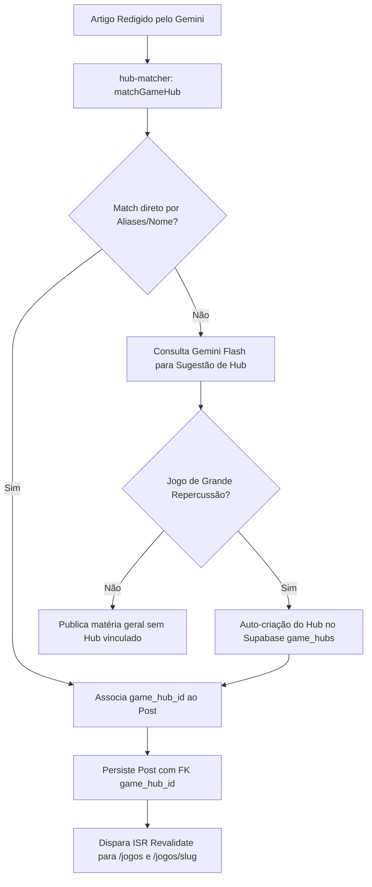

# Hubs de Jogos Permanentes & SEO de Cauda Longa (Fase 4)

Este documento descreve a arquitetura técnica, o funcionamento do módulo de auto-clustering e as diretrizes de SEO de cauda longa (Long-Tail) dos **Hubs de Jogos Permanentes** do **AIGamePortal**.

---

## 1. Visão Geral e Estratégia de Negócio

Enquanto notícias pontuais atraem picos de tráfego de curta duração (24h a 72h), jogadores frequentemente buscam por suas franquias favoritas de forma contínua durante anos:
- *"data de lançamento gta 6"*
- *"monster hunter wilds crossplay pc ps5"*
- *"elden ring requisitos e vendas"*

Os **Hubs de Jogos Permanentes** concentram todo o histórico, dados técnicos e novidades de um título em uma única URL canônica indexável (`/jogos/[slug]`), garantindo:
1. **Tráfego Orgânico Perene (Evergreen)**: Posicionamento contínuo em buscas do Google para termos de alta intenção de compra e busca de informações.
2. **Autoridade Temática (Topical Authority)**: Fortalecimento dos sinais E-E-A-T ao demonstrar cobertura especializada e acumulativa de cada franquia.
3. **Monetização Contínua**: Exibição contextual de produtos afiliados (jogos base, DLCs, consoles temáticos, periféricos) na seção "Onde Comprar".

---

## 2. Fluxo de Auto-Clustering de Tópicos (`lib/services/hub-matcher.ts`)

O módulo `hub-matcher` atua dentro do pipeline de ingestão jornalística (`scripts/sync-news.ts`):



### Algoritmo de Matching:
1. **Normalização Textual**: Converte texto e aliases para minúsculas e remove diacríticos (acentos como `ã`, `é`, `ō`) via `normalize("NFD").replace(/[\u0300-\u036f]/g, "")`.
2. **Fronteira de Palavras (`Word Boundaries`)**: Aplica regex seguro para evitar que termos curtos (ex: "in", "go", "pro") dêem falsos positivos em palavras maiores.
3. **Priorização por Especificidade**: Ordena os candidatos por tamanho de string decrescente (ex: "Grand Theft Auto VI" é avaliado antes de "GTA").

---

## 3. Estrutura da Página do Hub (`app/jogos/[slug]/page.tsx`)

A interface foi projetada com estética gamer moderna:
- **Hero Header Panorâmico**:
  - Banner widescreen com gradiente escuro e overlay `cyber-grid`.
  - Capa vertical do jogo com moldura estilizada, borda iluminada e sombra em profundidade.
  - Metacritic Score Badge colorido (verde para 90+, amarelo para 75-89, ou "Aguardando Avaliações").
  - Badges de plataformas suportadas (PS5, Xbox, PC, Switch).
  - Desenvolvedora, editora e data de lançamento destacadas.
- **Box de Sinopse & Ficha Técnica Oficial**:
  - Texto editorial detalhado em português do Brasil contextualizando a história e proposta do jogo.
  - Tabela técnica com metadados estruturados.
- **Linha do Tempo de Notícias (Timeline)**:
  - Feed dinâmico de todos os artigos vinculados a esse jogo, ordenados cronologicamente da mais recente para a mais antiga (`published_at DESC`).
  - Linha vertical conectando as matérias com bullets luminosos.
  - Badges de verificação de fatos (*Oficial* ou *Rumor com nota de confiabilidade 1-5*).
  - Resumo rápido em bullet points (TL;DR) e tempo de leitura estimado.
- **Box "Onde Comprar" (Afiliados Inteligentes)**:
  - Lista de produtos relevantes cruzados pelas palavras-chave do jogo (mídia física/digital, consoles, periféricos).
  - Botões de compra com tags de afiliados oficiais (ex: Amazon Brasil) e atributos de conformidade `rel="sponsored nofollow"`.

---

## 4. Dados Estruturados Schema.org (`VideoGame`)

Para obter Rich Results e snippets enriquecidos nos motores de busca, cada Hub emite dados estruturados nos formatos `VideoGame` e `BreadcrumbList`:

```json
{
  "@context": "https://schema.org",
  "@type": "VideoGame",
  "name": "Grand Theft Auto VI",
  "description": "Grand Theft Auto VI ruma ao estado de Leonida...",
  "image": [
    "https://.../cover.jpg",
    "https://.../banner.jpg"
  ],
  "operatingSystem": "PlayStation 5, Xbox Series X|S, PC",
  "applicationCategory": "Game",
  "author": {
    "@type": "Organization",
    "name": "Rockstar Studios"
  },
  "publisher": {
    "@type": "Organization",
    "name": "Rockstar Games"
  },
  "datePublished": "2025-11-20",
  "aggregateRating": {
    "@type": "AggregateRating",
    "ratingValue": 96,
    "bestRating": "100",
    "worstRating": "0",
    "ratingCount": 1
  }
}
```

---

## 5. Revalidação Incremental sob Demanda (ISR)

- As páginas `/jogos` e `/jogos/[slug]` utilizam `export const revalidate = 300;` (5 minutos) com `generateStaticParams()` para entrega rápida em CDN.
- Quando uma nova matéria sobre o jogo é publicada pelo pipeline, o endpoint `/api/revalidate` é acionado automaticamente com `path=/jogos/[slug]` e `path=/jogos`, garantindo que a linha do tempo reflita a novidade imediatamente sem necessidade de rebuild da aplicação.
