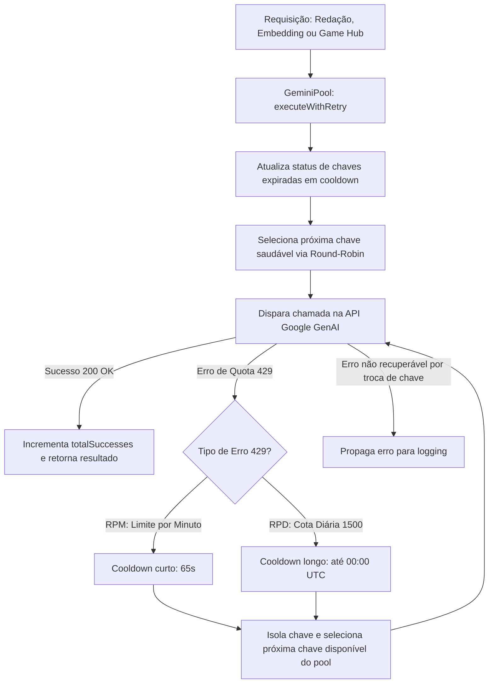

# Gemini API Key Pool: Arquitetura, Rotação e Failover de Cotas (Fase 1)

## 1. Visão Geral e Motivação

O portal **Made By AI Games** utiliza modelos da família Gemini para duas etapas críticas da esteira editorial:
1. **Deduplicação Semântica**: Geração de embeddings vetoriais de 768 dimensões com `gemini-embedding-001` e `text-embedding-004`.
2. **Redação Jornalística e SEO**: Reescrita e estruturação de matérias com `gemini-3.6-flash`, `gemini-flash-latest` e `gemini-1.5-flash`.
3. **Clustering de Game Hubs**: Avaliação e sugestão de centrais permanentes com `gemini-2.5-flash` e `gemini-1.5-flash`.

No plano gratuito (*Free Tier*) do Google AI Studio, cada projeto/conta possui limites rigorosos:
- **15 RPM** (*Requests Per Minute*): Picos de tráfego ou processamento em lote rápido resultam em erro `HTTP 429 Too Many Requests`.
- **1.500 RPD** (*Requests Per Day*): Cota diária máxima por projeto no plano gratuito.

Quando o sistema utilizava uma chave única (`GEMINI_API_KEY`), o esgotamento dessa cota causava o erro `GEMINI_QUOTA_EXCEEDED` e abortava a ingestão das notícias pendentes.

Com o **Gemini API Key Pool (`lib/services/gemini-pool.ts`)**, o portal passa a suportar **múltiplas contas/chaves**, distribuindo a carga de forma equilibrada e aplicando **failover automático instantâneo** quando uma cota é atingida.

---

## 2. Diagrama de Funcionamento e Resiliência



---

## 3. Principais Recursos Implementados

1. **Round-Robin Ativo**: Em vez de esgotar a primeira chave até quebrar, as requisições alternam circularmente entre todas as chaves sadias. Isso reduz drasticamente a chance de qualquer chave atingir o limite de 15 RPM.
2. **Diferenciação Inteligente de Cotas**:
   - **Limite de Minuto (RPM)**: Chave suspensa por 65 segundos e reativada automaticamente na mesma rodada.
   - **Limite Diário (RPD)**: Chave suspensa até o próximo reset de cota do Google AI Studio (00:00 UTC).
3. **Failover Imediato sem Perda de Matéria**: Se a requisição de redação falhar por cota, o gerenciador repete a chamada na próxima chave **sem descartar o artigo**.
4. **Mascaramento Seguro de Chaves (`maskApiKey`)**:
   - Chaves nunca são expostas integralmente no terminal ou nos logs (`AIzaSyDu...1AAA`).
5. **Retrocompatibilidade 100%**:
   - Suporta tanto a nova variável `GEMINI_API_KEYS` (chaves separadas por vírgula) quanto a chave única legada `GEMINI_API_KEY`.
   - Compatível com chamadas diretas via `ai.getPrimaryClient()` e abstração completa via `ai.execute(...)`.

---

## 4. Como Configurar no GitHub Actions e Vercel

### 4.1 No GitHub Actions (Execução dos Crons de Ingestão)

1. No repositório GitHub, acesse: **Settings > Secrets and variables > Actions > Repository secrets**.
2. Crie ou edite o secret `GEMINI_API_KEYS`:
   ```text
   AIzaSyA_ChaveConta1...,AIzaSyB_ChaveConta2...,AIzaSyC_ChaveConta3...
   ```
3. O workflow [.github/workflows/cron-sync-news.yml](file:///d:/IAProjects/AIGamePortal/.github/workflows/cron-sync-news.yml) já injeta automaticamente as variáveis:
   ```yaml
   env:
     GEMINI_API_KEYS: ${{ secrets.GEMINI_API_KEYS }}
     GEMINI_API_KEY: ${{ secrets.GEMINI_API_KEY }}
   ```

### 4.2 Na Vercel (Next.js / Rotas de API / Admin)

1. No painel do projeto na Vercel, acesse: **Settings > Environment Variables**.
2. Adicione a variável:
   - **Nome**: `GEMINI_API_KEYS`
   - **Valor**: `AIzaSyA_ChaveConta1...,AIzaSyB_ChaveConta2...`
   - **Ambientes**: Production, Preview, Development.

---

## 5. Telemetria e Validação

Durante a execução do pipeline ([scripts/sync-news.ts](file:///d:/IAProjects/AIGamePortal/scripts/sync-news.ts)), o terminal e os relatórios de execução exibem o status de cada chave:

```text
🤖 [GeminiPool] Inicializado com sucesso (3 chave(s) de API ativa(s)):
   - Chave #1 (AIzaSyDu...1AAA) [Status: healthy]
   - Chave #2 (AIzaSyDu...2BBB) [Status: healthy]
   - Chave #3 (AIzaSyDu...3CCC) [Status: healthy]
...
🤖 Telemetria do Pool de Chaves Gemini:
   Total de chaves: 3 | Saudáveis: 3 | Em Cooldown: 0 | Esgotadas Diárias: 0
   - Chave #1 (AIzaSyDu...1AAA): 12 sucesso(s), 0 erro(s) [healthy]
   - Chave #2 (AIzaSyDu...2BBB): 11 sucesso(s), 0 erro(s) [healthy]
   - Chave #3 (AIzaSyDu...3CCC): 11 sucesso(s), 0 erro(s) [healthy]
```

### 5.1 Testes Automatizados

O script [scripts/test-gemini-pool.ts](file:///d:/IAProjects/AIGamePortal/scripts/test-gemini-pool.ts) valida:
- Mascaramento e segurança de exibição.
- Classificação de erros 429 de minuto (RPM) vs diários (RPD).
- Diferenciação de erros de cota vs políticas de segurança (SAFETY).
- Deduplicação e limpeza de chaves redundantes.
- Failover imediato e quarentena de chaves.
- Auto-recuperação pós-expiração de cooldown.
- Lançamento de `GeminiAllKeysExhaustedError` caso todas as chaves estejam simultaneamente esgotadas.

Para rodar a suíte de testes:
```bash
npm run dev # ou
node -r tsx scripts/test-gemini-pool.ts
```

---

## 6. Próximas Etapas (Roadmap)

- **Fase 2**: Persistência do pool no Supabase (`gemini_api_keys`) com sincronização bidirecional e métricas históricas de requisições.
- **Fase 3**: Painel Administrativo (`/admin/ia` ou `/admin/chaves-ia`) para adição/remoção visual de chaves, teste de conectividade (ping), reset manual de cooldowns e telemetria de consumo.
