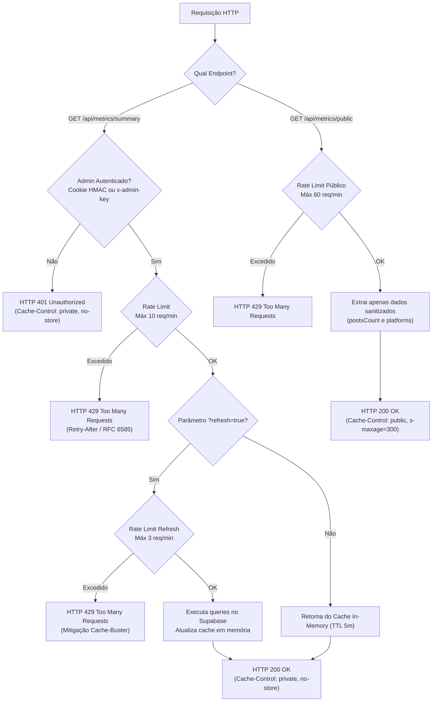

# Hardening de Segurança — Fase 7: Telemetria & Métricas B2B

## 1. Visão Geral e Justificativa de Segurança Corporativa

Durante a auditoria de segurança da infraestrutura do portal **Made By AI Games**, identificou-se uma exposição crítica de **inteligência competitiva** e um vetor de ataque de **Negação de Serviço (DoS)** na rota de telemetria interna:

### 1.1 Vetor de Risco: Vazamento de Dados Financeiros e Estratégicos
O endpoint `GET /api/metrics/summary` operava de forma irrestrita e pública, retornando um payload executivo completo que continha:
- **Métricas Financeiras Comerciais**: Volume Bruto de Mercadorias (GMV estimado em R$), taxa de conversão de cliques de afiliados, volume estimado de comissões monetárias e ticket médio de compras da audiência gamer.
- **Custos Operacionais e CAC de IA**: Custo exato por artigo gerado via Google Gemini Flash (~$0.00028 USD / ~R$ 0,0015 BRL) comparado com a precificação de redatores tradicionais (R$ 45,00), margem operacional (99.9%) e total de economia financeira acumulada.
- **Inteligência de Audiência & CRM**: Total de assinantes cadastrados e ativos na newsletter, taxa de abertura de e-mails (46.8%), taxa de cliques (14.2%) e métricas de servidores do Discord.
- **Tabela de Preços e Pacotes de Patrocínio**: Lista de pacotes comerciais (Hero Takeover, Lançamento Indie, Patrocínio de Servidor) com valores de tabela (de R$ 1.800 a R$ 3.500/mês), entregáveis contratuais e estimativas de impressões.

**Impacto de Negócio**: A exposição pública dessas métricas permitia que concorrentes, anunciantes e terceiros tivessem acesso irrestrito ao modelo de custos, margem operacional real e volume de receita do portal, minando o poder de barganha comercial e expondo dados agregados de audiência.

### 1.2 Vetor de Risco: Ataque de Cache-Buster DoS
O endpoint aceitava o parâmetro de query string `?refresh=true`. Quando invocado com esse parâmetro:
- O cache em memória de 5 minutos era imediatamente invalidado.
- 5 consultas agregadas concorrentes eram disparadas simultaneamente contra o banco PostgreSQL do Supabase (contagem exata de posts publicados, contagem de posts das últimas 24 horas, contagem dos últimos 7 dias, agregação de views por categoria e busca de produtos de afiliados).
- Sem rate limiting e sem autenticação, um script atacante disparando dezenas de requisições por segundo com `?refresh=true` esgotaria o pool de conexões do Supabase, causando indisponibilidade total do portal.

---

## 2. Medidas Implementadas na Fase 7



### 2.1 Autenticação Mandatória em `GET /api/metrics/summary`
- Integrado o validador `isServerAdminAuthenticated(request)` de `lib/utils/admin-auth.ts`.
- Suporte a dois mecanismos de autenticação:
  1. **Cookie de Sessão Administrativa (`admin_session`)**: Assinado digitalmente via HMAC-SHA256 com timestamp e expiração estrita de 7 dias (usado pelo painel `/admin/metricas`).
  2. **Cabeçalho `x-admin-key`**: Validação com temporização constante (`safeConstantTimeCompare`) contra `ADMIN_SECRET_KEY` para scripts de automação e telemetria interna.
- Qualquer requisição não autenticada é imediatamente encerrada com:
  - **Status**: `HTTP 401 Unauthorized`
  - **Payload**: `{ "success": false, "error": "Acesso não autorizado às métricas internas." }`
  - **Headers**: `Cache-Control: private, no-cache, no-store, must-revalidate`

### 2.2 Mitigação Estrita de Cache-Buster DoS
- **Rate Limit Geral da Rota**: Máximo de **10 requisições por minuto** por IP (`prefix: "metrics_summary_endpoint"`).
- **Rate Limit de Forçamento de Cache (`?refresh=true`)**: Máximo de **3 requisições por minuto** por IP (`prefix: "metrics_summary_refresh"`).
- Resposta de bloqueio: `HTTP 429 Too Many Requests` com conformidade à **RFC 6585**:
  - `Retry-After`: Tempo restante em segundos até a liberação da janela.
  - `X-RateLimit-Limit`: Limite configurado da janela.
  - `X-RateLimit-Remaining`: `0`.
  - `X-RateLimit-Reset`: Timestamp UTC de expiração.

### 2.3 Separação de Responsabilidade: Endpoint Público Sanitizado (`/api/metrics/public`)
Para atender requisitos de componentes de interface pública (ex.: rodapés institucionais, contadores da página inicial ou widgets de estatísticas gerais):
- Criado o arquivo [app/api/metrics/public/route.ts](file:///d:/IAProjects/AIGamePortal/app/api/metrics/public/route.ts).
- Implementada a função sanitizada `getPublicMetricsSummary()` em [lib/data/metrics-summary.ts](file:///d:/IAProjects/AIGamePortal/lib/data/metrics-summary.ts).
- **Payload Permitido**:
  ```json
  {
    "success": true,
    "data": {
      "postsCount": 150,
      "platforms": [
        { "platform": "PlayStation", "count": 52, "percentage": 23.3 },
        { "platform": "Xbox", "count": 44, "percentage": 19.7 },
        { "platform": "PC Gaming", "count": 46, "percentage": 20.6 },
        { "platform": "Nintendo", "count": 35, "percentage": 15.7 },
        { "platform": "Hardware & Geral", "count": 45, "percentage": 20.2 }
      ]
    }
  }
  ```
- **Campos Rigorosamente Omitidos**:
  - Afiliados, cliques, conversões estimadas, comissões monetárias e GMV.
  - Custos de tokens de inteligência artificial, margem operacional e CAC.
  - Dados de assinantes da newsletter e estatísticas do servidor Discord.
  - Pacotes de patrocínio, formatos e valores de venda.
- **Cache Público Apropriado**:
  - `Cache-Control: public, s-maxage=300, stale-while-revalidate=600`
  - `CDN-Cache-Control: public, s-maxage=300, stale-while-revalidate=600`

### 2.4 Ajuste nos Cabeçalhos Globais (`next.config.ts`)
- Substituída a regra que concedia cache CDN público para `/api/metrics/summary`.
- A regra de cache da CDN da Cloudflare e Vercel agora se aplica estritamente a `/api/metrics/public`.
- O endpoint administrativo `/api/metrics/summary` emite explicitamente `Cache-Control: private, no-cache, no-store, must-revalidate`, impedindo armazenamento intermediário em proxies compartilhados.

### 2.5 Resiliência no Painel Administrativo (`app/admin/metricas/admin-view.tsx`)
- Atualizado o método `handleRefresh` no cliente para interceptar respostas com status `429` e `401`.
- Fornece feedback claro e contextual ao administrador caso o limite de 3 atualizações por minuto seja excedido.

---

## 3. Matriz de Comparação de Endpoints

| Característica | `GET /api/metrics/summary` (Privado) | `GET /api/metrics/public` (Público) |
| :--- | :--- | :--- |
| **Público-Alvo** | Administradores e Automações Internas | Frontend Público, Rodapé, Estatísticas Gerais |
| **Autenticação** | **Obrigatória** (Cookie `admin_session` ou `x-admin-key`) | Nenhuma (Acesso Público) |
| **Status Não-Autenticado** | `HTTP 401 Unauthorized` | N/A (`HTTP 200 OK`) |
| **Dados Expostos** | GMV, Comissões, CAC IA, Newsletter, Patrocínios | `postsCount`, `platforms` (sanitizado) |
| **Controle de Cache** | `private, no-cache, no-store, must-revalidate` | `public, s-maxage=300, stale-while-revalidate=600` |
| **Cache CDN / Cloudflare** | **Proibido** (Bypass total) | **Permitido** (Edge Cache de 300s) |
| **Parâmetro `?refresh=true`** | Permitido (limitado a 3 req/min) | **Ignorado** (sempre consome cache consolidado) |
| **Rate Limit Global** | 10 req/min por IP | 60 req/min por IP |

---

## 4. Resultados dos Testes Automatizados

A suíte de testes unitários e de integração [scripts/test-phase7.ts](file:///d:/IAProjects/AIGamePortal/scripts/test-phase7.ts) foi executada com 100% de aprovação:

1. **Rejeição Anônima**: Requisição anônima a `/api/metrics/summary` bloqueada com `HTTP 401` e mensagem `"Acesso não autorizado às métricas internas."`.
2. **Autorização Administrativa**: Chave `x-admin-key` e cookie `admin_session` validados com sucesso retornando payload completo (`HTTP 200`).
3. **Mitigação Cache-Buster**: A 4ª requisição no mesmo minuto com `?refresh=true` foi bloqueada com `HTTP 429` e headers RFC 6585 (`Retry-After: 60`, `X-RateLimit-Limit: 3`).
4. **Rate Limit Geral**: A 11ª requisição no mesmo minuto foi bloqueada com `HTTP 429` (`X-RateLimit-Limit: 10`).
5. **Auditoria de Vazamento no Endpoint Público**: Verificada ausência total (0 chaves) de atributos sensíveis em `/api/metrics/public`.
6. **Integração HTTP End-to-End**: Validação em servidor HTTP real em execução na porta 3000.
