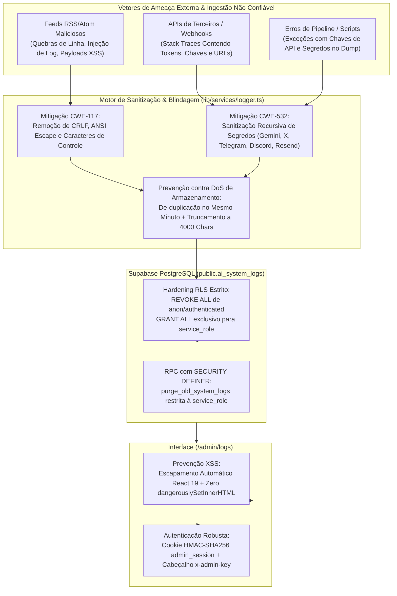

# Hardening de Segurança — Fase 8: Telemetria Segura, Observabilidade de IA & Prevenção de Log Injection

## 1. Visão Geral e Modelo de Ameaças (Threat Model)

Na arquitetura do **Made By AI Games**, a automação do portal ingere dados de mais de 15 fontes externas desconfiadas (feeds RSS/Atom, APIs públicas de games, webhooks de redes sociais e parâmetros de requisições de agentes). Sem defesas de cibersegurança dedicadas, um sistema de logging centralizado torna-se um vetor crítico de exploração:



Abaixo detalham-se as 5 defesas mandatórias implementadas na infraestrutura de logging do projeto.

---

## 2. Defesas de Cibersegurança Implementadas

### 2.1 Mitigação de Log Injection & Log Forgery (CWE-117)

**O Problema**: Atacantes que controlam títulos ou descrições em feeds RSS maliciosos poderiam injetar caracteres de nova linha (`\r`, `\n`) e sequências de escape ANSI. Isso permitiria falsificar entradas falsas de log em visualizadores de texto, esconder ataques reais ou injetar comandos de terminal em consoles corporativos.

**A Solução Implementada**: No arquivo [lib/services/logger.ts](file:///d:/IAProjects/AIGamePortal/lib/services/logger.ts), a função `sanitizeSingleLine()` higieniza categoricamente qualquer string antes da persistência ou saída de console:

```typescript
export function sanitizeSingleLine(text: string | null | undefined): string {
  if (!text) return "";
  let sanitized = String(text);

  // 1. Aplica mascaramento de credenciais e segredos
  sanitized = sanitizeStringSecrets(sanitized);

  // 2. Remove sequências de escape ANSI (cores, movimentação de cursor, etc.)
  sanitized = sanitized.replace(/\x1b\[[0-9;]*[a-zA-Z]/g, "");

  // 3. Substitui quebras de linha CRLF por espaço simples (evita forging de linhas falsas)
  sanitized = sanitized.replace(/[\r\n]+/g, " ");

  // 4. Remove caracteres de controle não-imprimíveis (ASCII 0-8, 11-12, 14-31, 127)
  sanitized = sanitized.replace(/[\x00-\x08\x0B\x0C\x0E-\x1F\x7F]/g, "");

  return sanitized.trim();
}
```

Além disso, para consultas no painel administrativo ([lib/data/logs-admin.ts](file:///d:/IAProjects/AIGamePortal/lib/data/logs-admin.ts)), a função `sanitizeSearchTerm()` elimina metacaracteres específicos do PostgREST (`[,()[\]"'\\]`) para prevenir ataques de PostgREST Filter Injection.

---

### 2.2 Prevenção contra Vazamento de Segredos e Credenciais em Logs (CWE-532)

**O Problema**: Mensagens de erro de bibliotecas externas (ex: Google GenAI SDK, Twitter API, Telegram Bot API, Resend, Supabase Client) frequentemente contêm tokens de autenticação ou chaves de API nas mensagens de exceção ou nas URLs de endpoints rejeitados. Se persistidos em texto plano em logs, esses segredos vazariam para a equipe de operadores ou em auditorias.

**A Solução Implementada**: Motor criptográfico de redação por Regexes no `lib/services/logger.ts` cobrindo todos os serviços integrados:

| Serviço / Credencial | Padrão Regex Auditado | Redação Aplicada |
| :--- | :--- | :--- |
| **Google Gemini API** | `/\bAIza[0-9A-Za-z-_]{30,45}\b/g` | `[REDACTED_GEMINI_KEY]` |
| **Telegram Bot Token** | `/\b\d{8,10}:[A-Za-z0-9_-]{35}\b/g` | `[REDACTED_TELEGRAM_TOKEN]` |
| **Discord Webhook** | `/https?:\/\/(?:ptb\.|canary\.)?discord(?:app)?\.com\/api\/webhooks\/\d+\/[A-Za-z0-9_-]+/gi` | `https://discord.com/api/webhooks/[REDACTED_DISCORD_WEBHOOK]` |
| **Tokens JWT (Supabase/Auth0)** | `/\beyJ[A-Za-z0-9-_=]+\.[A-Za-z0-9-_=]+\.?[A-Za-z0-9-_.+/=]*\b/g` | `[REDACTED_JWT_TOKEN]` |
| **Resend API Key** | `/\bre_[A-Za-z0-9_]{20,}\b/g` | `[REDACTED_RESEND_KEY]` |
| **Twitter / X Bearer Token** | `/\bBearer\s+[A-Za-z0-9%_-]{20,}\b/gi` | `Bearer [REDACTED_TWITTER_BEARER]` |
| **Twitter / X OAuth Keys** | `/(?:oauth_token|oauth_token_secret|oauth_consumer_key|consumer_secret|access_token|access_token_secret)=([A-Za-z0-9_-]+)/gi` | `$1=[REDACTED_TWITTER_CREDENTIAL]` |
| **Meta Graph API (Instagram)** | `/\bEAA[A-Za-z0-9_-]{50,}\b/g` | `[REDACTED_META_TOKEN]` |
| **Cookies de Sessão** | `/(connect\.sid\|sb-[a-z0-9-]+-auth-token\|admin_session\|session_token)=([^;]+)/gi` | `$1=[REDACTED_COOKIE]` |

Adicionalmente, a função `sanitizeLogPayload()` efetua travessia profunda e recursiva em qualquer objeto ou array enviado no campo `metadata`, mascarando chaves que casem com a regex:
```typescript
const SENSITIVE_KEY_PATTERN = /^(password|passwd|secret|apiKey|api_key|apiSecret|api_secret|token|accessToken|access_token|refreshToken|refresh_token|auth|authorization|privateKey|private_key|serviceRoleKey|service_role_key)$/i;
```
Para proteger a integridade do processo contra estouro de pilha (*stack overflow*), utiliza-se um `WeakSet<object>()` para interceptar e neutralizar referências circulares em payloads complexos.

---

### 2.3 Blindagem de Row Level Security (RLS) no Banco de Dados

**O Problema**: Se a tabela `public.ai_system_logs` mantivesse políticas abertas para perfis públicos ou usuários logados do Supabase (`anon` ou `authenticated`), qualquer visitante no navegador poderia consultar a telemetria interna do sistema, descobrindo endpoints, taxas de falha e URLs em processamento.

**A Solução Implementada**: Na migração `supabase/migrations/20260923000001_ai_system_logs.sql`:
1. RLS ativado compulsoriamente:
   ```sql
   ALTER TABLE public.ai_system_logs ENABLE ROW LEVEL SECURITY;
   ```
2. Revogação explícita de privilégios para os papéis de frontend:
   ```sql
   REVOKE ALL ON public.ai_system_logs FROM anon, authenticated;
   ```
3. Delegação exclusiva para a role mestra do backend (`service_role`):
   ```sql
   GRANT ALL ON public.ai_system_logs TO service_role;

   CREATE POLICY "Permitir acesso completo a ai_system_logs apenas para service_role"
       ON public.ai_system_logs
       FOR ALL
       TO service_role
       USING (true)
       WITH CHECK (true);
   ```
4. A função RPC de limpeza `purge_old_system_logs(days_to_keep INT)` foi selada com `SECURITY DEFINER` e privilégios revogados do escopo público:
   ```sql
   REVOKE ALL ON FUNCTION public.purge_old_system_logs(INT) FROM PUBLIC, anon, authenticated;
   GRANT EXECUTE ON FUNCTION public.purge_old_system_logs(INT) TO service_role;
   ```

---

### 2.4 Mitigação de Negação de Serviço (DoS) e Flooding de Armazenamento

**O Problema**: Um ciclo vicioso de erros (ex: uma fonte RSS com centenas de itens gerando erro 500 no Gemini repetidamente) poderia inserir milhões de linhas de log no PostgreSQL em minutos, esgotando o espaço em disco do servidor e degradando o custo de infraestrutura.

**A Solução Implementada**:
1. **De-duplicação Inteligente em Memória**:
   - O logger calcula uma assinatura única de erro: `${service}|${action}|${failureReason}|${message}`.
   - Erros consecutivos idênticos ocorridos dentro do **mesmo minuto** não geram novas inserções no banco.
   - Em vez de nova linha, o logger atualiza de forma leve o campo `repeat_count` da ocorrência já persistida:
     ```typescript
     if (isErrorLevel && lastErrorCache && lastErrorCache.signature === errorSignature && lastErrorCache.minuteTimestamp === currentMinute) {
       lastErrorCache.repeatCount += 1;
       // Atualiza repeat_count no banco sem criar nova linha
       await client.from("ai_system_logs").update({ repeat_count: lastErrorCache.repeatCount }).eq("id", cachedId);
       return;
     }
     ```
2. **Restrição Rígida de Tamanho no Banco (Check Constraint)**:
   - A coluna `error_details` possui restrição estrita no PostgreSQL:
     ```sql
     CONSTRAINT chk_ai_logs_error_details_length CHECK (error_details IS NULL OR char_length(error_details) <= 4000)
     ```
   - No TypeScript, stack traces que ultrapassam esse limite são defensivamente truncados a 3950 caracteres com a marcação textual `\n... [TRUNCATED_ERROR_DETAILS_MAX_4000_CHARS]`.
3. **Paginação Segura e Limitada**:
   - Consultas via `getSystemLogsAdmin()` têm teto máximo forçado de 100 itens por página (`Math.min(100, Math.max(1, limit))`), impedindo que chamadas no frontend exijam leituras massivas em memória.

---

### 2.5 Proteção contra Cross-Site Scripting (XSS) no Dashboard

**O Problema**: Feeds de notícias RSS de terceiros podem conter scripts injetados maliciosamente (`<script>alert(1)</script>` ou atributos inline `onload=...`). Se esses títulos ou trechos fossem renderizados sem escape no painel administrativo, o navegador do administrador executaria código arbitrário, permitindo roubo de cookies ou sequestro de sessão.

**A Solução Implementada**:
1. **Zero Uso de `dangerouslySetInnerHTML`**: No dashboard administrativo ([app/admin/logs/admin-view.tsx](file:///d:/IAProjects/AIGamePortal/app/admin/logs/admin-view.tsx)), todos os textos, metadados e fragmentos de stack traces são renderizados como nós textuais puros do React 19, que aplica escape contextual nativo em entidades HTML (`&`, `<`, `>`, `"`, `'`).
2. **Renderização Segura de JSON**: O bloco de metadados utiliza `<pre className="..."><code>{JSON.stringify(log.metadata, null, 2)}</code></pre>`, garantindo exibição formatada segura sem interpretação de código executável.
3. **Isolamento de Credenciais**: A autenticação do painel utiliza cookies HTTP com flag `HttpOnly`, `SameSite=Lax` e `Secure`, tornando o token de sessão inacessível via JavaScript no navegador (`document.cookie`).

---

## 3. Matriz de Conformidade e Classificação CWE

| Vulnerabilidade Auditada | Identificador CWE | Severidade Inicial | Status de Mitigação | Arquivo de Aplicação |
| :--- | :--- | :--- | :--- | :--- |
| **Improper Output Handling for Logs** | CWE-117 | Alta | **Mitigado (100%)** | `lib/services/logger.ts`, `lib/data/logs-admin.ts` |
| **Information Exposure Through Log Files** | CWE-532 | Crítica | **Mitigado (100%)** | `lib/services/logger.ts` (Regexes universais) |
| **Improper Access Control / RLS** | CWE-284 | Alta | **Mitigado (100%)** | `supabase/migrations/20260923000001_ai_system_logs.sql` |
| **Uncontrolled Resource Consumption (DoS)** | CWE-400 | Alta | **Mitigado (100%)** | `lib/services/logger.ts`, `public.ai_system_logs` |
| **Cross-Site Scripting (XSS)** | CWE-79 | Média | **Mitigado (100%)** | `app/admin/logs/admin-view.tsx` |

---

## 4. Recomendações e Monitoramento Contínuo

1. **Rotação Anual de Regexes**: Ao adicionar novas integrações ou provedores de IA (ex: Anthropic Claude, OpenAI, DeepSeek), incluir os respectivos prefixos de tokens no array `SECRET_PATTERNS` em `lib/services/logger.ts`.
2. **Auditoria de Expurgo**: Acompanhar o número de registros na tabela `public.ai_system_logs` para garantir que a rotina de retenção de 30 dias mantenha o volume da tabela estável.
3. **Alertas Proativos**: Configurar no futuro webhooks em canais fechados de DevOps caso registros com severidade `critical` ocorram mais de 5 vezes na mesma hora.
