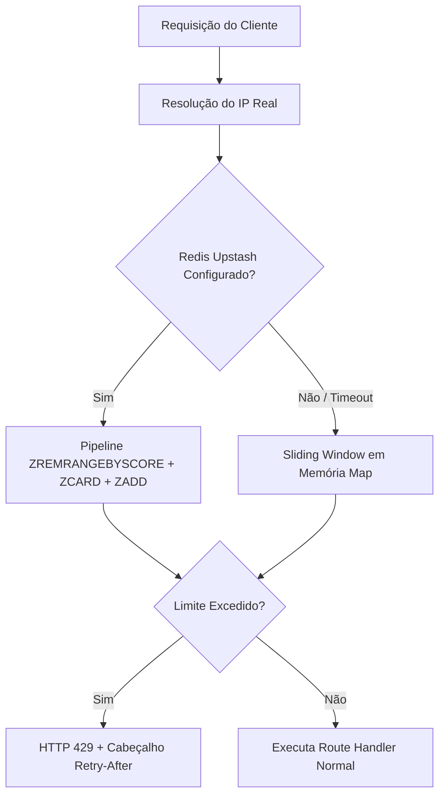
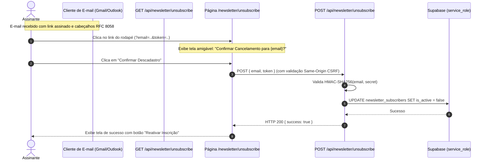

# Hardening de Segurança — Fase 2 (Rate Limiting, Fluxos Seguros e RLS)

Este documento detalha as implementações técnicas de segurança realizadas durante a **Fase 2** do plano de remediação do portal **Made By AI Games** (Next.js 15, App Router, TypeScript, Supabase).

---

## 1. Arquitetura Modular de Rate Limiting

### 1.1 Visão Geral e Algoritmo
O módulo [`lib/utils/rate-limit.ts`](../../lib/utils/rate-limit.ts) foi construído para blindar as APIs da aplicação contra ataques de negação de serviço (DoS), scraping abusivo e tentativas de força bruta (brute-force).

O algoritmo implementado é o **Sliding Window Log (Janela Deslizante)**:
- Mantém o registro temporal exato de requisições de cada cliente (identificado pelo endereço IP real).
- Ao receber uma nova requisição, descarta os registros que caíram fora da janela de tolerância (`now - windowMs`).
- Se a quantidade de requisições na janela atual for igual ou superior ao limite, a requisição é imediatamente rejeitada com status **HTTP 429 Too Many Requests**.
- Caso contrário, a nova requisição é aceita e registrada.



### 1.2 Suporte Híbrido: Memória Local + Upstash Redis REST
- **Modo In-Memory (Zero Dependências Externas)**: Utiliza `Map<string, WindowEntry>` com coleta de lixo (GC) oportunista que limpa registros inativos a cada 60 segundos ou quando a tabela atinge 5.000 chaves.
- **Modo Distribuído (Edge/Serverless Multi-Instância)**: Caso as variáveis de ambiente `UPSTASH_REDIS_REST_URL` e `UPSTASH_REDIS_REST_TOKEN` estejam presentes, as checagens ocorrem via pipeline atômica Redis Sorted Set (`ZADD`, `ZCARD`, `ZREMRANGEBYSCORE`, `EXPIRE`) com timeout de segurança de 1.2s e fallback silencioso para a memória local.

### 1.3 Cabeçalhos HTTP Padronizados (RFC 6585)
Quando o limite de taxa é excedido, o helper `createRateLimitResponse` injeta os seguintes cabeçalhos na resposta:
- `Retry-After`: Tempo restante em segundos até que uma nova requisição seja aceita.
- `X-RateLimit-Limit`: Limite máximo de requisições permitido na janela.
- `X-RateLimit-Remaining`: Quantidade restante de requisições permitidas (0 quando bloqueado).
- `X-RateLimit-Reset`: Timestamp UTC (em segundos) em que a janela deslizante será resetada.

### 1.4 Tabela de Endpoints Protegidos e Limites

| Endpoint | Método | Limite | Janela | Rationale / Vetor Mitigado |
| :--- | :--- | :--- | :--- | :--- |
| `/api/admin/auth` | `POST` | 5 requisições | 15 minutos (900s) | Mitigação de ataques de força bruta e credential stuffing contra a chave mestra de administração. |
| `/api/newsletter/subscribe` | `POST` | 3 inscrições | 1 minuto (60s) | Prevenção de bombardeamento de inscrições de spam, poluição da base e esgotamento de quota na Resend. |
| `/api/revalidate` | `GET`, `POST` | 10 revalidações | 1 minuto (60s) | Prevenção de ataques de DoS por recompilação pesada de páginas sob demanda (ISR Storm). |
| `/api/admin/discord` | `POST` | 3 testes | 1 minuto (60s) | Proteção contra rate limits da API do Discord e spam involuntário nos canais de ofertas e notícias. |
| `/api/admin/social` | `POST` | 3 testes | 1 minuto (60s) | Proteção contra esgotamento precoce de créditos pagos no X (Twitter) e spam na API de bots do Telegram. |
| `/api/newsletter/unsubscribe` | `POST` | 5 cancelamentos | 1 minuto (60s) | Proteção contra enumeração maliciosa de e-mails e sobrecarga do banco de dados. |

---

## 2. Fluxo Seguro de Descadastro de Newsletter (Unsubscribe)

### 2.1 O Problema Anterior (Vulnerabilidade OWASP)
No fluxo anterior, o endpoint `/api/newsletter/unsubscribe` executava uma mutação destrutiva no banco (`is_active = false`) via requisição simples `GET /api/newsletter/unsubscribe?email=...`.

Essa abordagem causava duas falhas críticas de segurança e usabilidade:
1. **Falsos Positivos de Descadastro**: Scanners corporativos de e-mail (Outlook SafeLinks, Gmail Link Scanner, antivírus de gateways corporativos) pré-carregavam links contidos nos e-mails recebidos para checar vírus/phishing via método `GET`, desativando automaticamente os leitores sem qualquer ação humana.
2. **Insegurança e Descadastros Forjados**: Qualquer terceiro que soubesse o e-mail de um assinante poderia chamar o endpoint `GET` e cancelar sua inscrição de forma maliciosa.

### 2.2 Nova Arquitetura Criptográfica e Conformidade RFC 8058
O novo fluxo resolve definitivamente essas questões combinando assinatura digital, separação de verbos HTTP e tela de confirmação:



### 2.3 Geração e Validação de Tokens HMAC-SHA256
Em [`lib/utils/security.ts`](../../lib/utils/security.ts):
- A função `generateUnsubscribeToken(email)` calcula:
  $$\text{HMAC-SHA256}(\text{normalized\_email}, \text{SECRET})$$
  onde `SECRET` é resolvido a partir de `NEWSLETTER_UNSUBSCRIBE_SECRET`, `ADMIN_SECRET_KEY` ou `SUPABASE_SERVICE_ROLE_KEY`.
- A função `verifyUnsubscribeToken(email, token)` valida a assinatura utilizando `safeConstantTimeCompare` (mitigando ataques de temporização).

### 2.4 Conformidade com RFC 8058 (One-Click Unsubscribe)
No disparo semanal executado por [`scripts/send-weekly-newsletter.ts`](../../scripts/send-weekly-newsletter.ts), cada e-mail é gerado com:
1. **Cabeçalhos de 1-Clique para Clientes de E-mail**:
   ```http
   List-Unsubscribe: <https://aigameportal.com/api/newsletter/unsubscribe?email=gamer%40dominio.com&token=3b8f...>
   List-Unsubscribe-Post: List-Unsubscribe=One-Click
   ```
   Quando o usuário clica no botão nativo "Cancelar inscrição" no cabeçalho do Gmail ou Yahoo, o cliente envia um `POST` direto para a URL assinada, processando o cancelamento sem exigir navegação.
2. **Link Seguro no Rodapé HTML**:
   Aponta diretamente para a página de confirmação:
   `https://aigameportal.com/newsletter/unsubscribe?email=gamer%40dominio.com&token=3b8f...`

---

## 3. Padronização de Privilégios no Supabase RLS

### 3.1 O Problema de RLS (*Row Level Security*)
O Supabase possui regras estritas de RLS configuradas em migrações SQL:
- Tabelas como `newsletter_subscribers` (para SELECT de lista e exclusão), `newsletter_settings`, `discord_settings`, `social_settings` e leitura de `affiliate_clicks` possuem políticas declaradas como:
  ```sql
  TO service_role USING (true);
  ```
- Anteriormente, os módulos `newsletter-admin.ts`, `affiliates.ts` e `discord-admin.ts` utilizavam `createServerClient()`, o qual utiliza a chave pública anônima (`NEXT_PUBLIC_SUPABASE_ANON_KEY`).
- Sob essas condições, requisições do painel administrativo recebiam dados vazios ou erros de violação de RLS no banco de dados.

### 3.2 Solução Implementada
1. **Refinamento de `createAdminClient()` em [`lib/supabase/server.ts`](../../lib/supabase/server.ts)**:
   - Valida formalmente a variável de ambiente `SUPABASE_SERVICE_ROLE_KEY`.
   - Caso a chave esteja ausente ou contenha o valor padrão de exemplo (`your-service-role-key-here`), retorna `null` explicitamente, em vez de misturar permissões com a chave anônima.
   - Exporta a flag `isServiceRoleConfigured: boolean`.
2. **Padronização na Camada de Dados**:
   Todos os arquivos de administração interna foram refatorados para o padrão seguro:
   ```typescript
   const supabase = createAdminClient() || createServerClient();
   ```
   - Em produção com `SUPABASE_SERVICE_ROLE_KEY`: o cliente administrativo executa operações com privilégios completos de serviço, bypassando o RLS com segurança.
   - Em desenvolvimento local sem chaves: fallback gracioso para o catálogo mock sem travar a compilação ou a interface.
