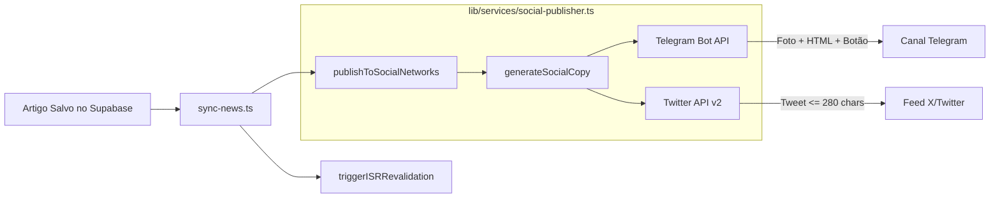

# Automação e Distribuição em Redes Sociais — AIGamePortal

Este documento detalha o ecossistema de redes sociais, comunidades oficiais e o funcionamento do módulo de **Distribuição Multi-canal Automática** ([lib/services/social-publisher.ts](file:///d:/IAProjects/AIGamePortal/lib/services/social-publisher.ts)).

---

## 0. Canais e Comunidades Oficiais do Portal

O **Made By AI Games** mantém presença ativa nas seguintes plataformas oficiais, integradas de forma nativa e discreta em toda a interface do usuário:

| Canal | Handle / Nome | Link de Acesso | Finalidade no Ecossistema |
| :--- | :--- | :--- | :--- |
| **X (Twitter)** | `@MadeByAiGames` | [x.com/MadeByAiGames](https://x.com/MadeByAiGames) | Breaking news, enquetes e atualizações velozes. |
| **Discord** | Comunidade VIP | [discord.gg/C6tYRUBPd](https://discord.gg/C6tYRUBPd) | Alertas de jogos 100% grátis e fórum da comunidade. |
| **YouTube** | `@madebyaigames` | [youtube.com/@madebyaigames](https://www.youtube.com/@madebyaigames) | Trailers oficiais, resumos e análises em vídeo. |
| **Telegram Bot** | `@MadeByAiGamesBot` | [t.me/MadeByAiGamesBot](https://t.me/MadeByAiGamesBot) | Alertas instantâneos de notícias urgentes no celular. |
| **Instagram** | `@madebyaigames` | [instagram.com/madebyaigames](https://www.instagram.com/madebyaigames/) | Reels, infográficos gerados por IA e bastidores. |

Todas as constantes estão centralizadas no módulo tipado [lib/constants/socials.ts](file:///d:/IAProjects/AIGamePortal/lib/constants/socials.ts) e renderizadas pelo componente [components/social-links.tsx](file:///d:/IAProjects/AIGamePortal/components/social-links.tsx).

---

## 1. Visão Geral

Assim que uma notícia inédita e verificada é gravada no banco de dados e seu cache ISR é invalidado, o sistema dispara publicações otimizadas para as redes sociais conectadas:

1. **Telegram**: Envio via Bot API (`sendPhoto` ou `sendMessage`) para canal público ou grupo gamer, com formatação HTML rica, capa e botão inline interativo.
2. **X (Twitter)**: Publicação de tweet via `twitter-api-v2` utilizando OAuth 1.0a User Context, respeitando rigorosamente o limite de 280 caracteres.



---

## 2. Social Copywriter (Regras de Copy Gamer)

A função `generateSocialCopy(payload)` transforma os metadados brutos do artigo em textos magnéticos:

### 2.1 Gancho Forte (Hook)
- **Notícias Verificadas**: Iniciadas com emojis temáticos da comunidade gamer (`🎮`, `💥`, `🔥`).
- **Rumores / Vazamentos (`is_rumor: true`)**: Prefixa obrigatoriamente `🚨 [RUMOR]` para total transparência editorial com a audiência.

### 2.2 Resumo em Bullet Points
- Extrai exatamente **2 bullet points ultra-resumidos** a partir do array `tldr` gerado pelo Gemini.
- Utiliza marcadores padronizados `▪️`.

### 2.3 Link Canônico
- Aponta diretamente para o artigo completo no portal (`https://aigameportal.com.br/noticias/[slug]`).

### 2.4 Hashtags Estratégicas Contextuais
- Mapeadas automaticamente pela categoria principal e metadados de plataformas:
  - **PlayStation**: `#PlayStation #PS5 #Games #Gaming`
  - **Xbox**: `#Xbox #XboxSeriesX #GamePass #Games`
  - **Nintendo**: `#Nintendo #NintendoSwitch #Games #Gaming`
  - **PC Gaming**: `#PCGaming #Steam #PCGamer #Games`
  - **Geral**: `#Games #Gaming #NoticiasGames #Gamer`
  - **Se Rumor**: Adiciona `#Rumor` estrategicamente no conjunto de hashtags.

---

## 3. Especificações por Canal

### 3.1 Telegram (Bot API)

- **Endpoints**:
  - `POST https://api.telegram.org/bot<TOKEN>/sendPhoto` (prioridade quando há capa válida)
  - `POST https://api.telegram.org/bot<TOKEN>/sendMessage` (fallback automático)
- **Modo de Parse**: `HTML` (com sanitização via `escapeTelegramHtml` para prevenir erros de parsing em tags como `<`, `>`, `&`).
- **Botão Inline**:
  ```json
  {
    "inline_keyboard": [
      [
        {
          "text": "Ler Matéria Completa 🎮",
          "url": "https://aigameportal.com.br/noticias/[slug]"
        }
      ]
    ]
  }
  ```
- **Exemplo de Renderização no Telegram**:
  ```
  🎮 PlayStation anuncia novo State of Play com 40 minutos de novidades

  ▪️ Transmissão ao vivo acontecerá na próxima quinta-feira às 18h com foco em títulos first-party.
  ▪️ Mais de 15 jogos para PlayStation 5 e PS VR2 receberão datas de lançamento e trailers.

  🔗 aigameportal.com.br/noticias/playstation-anuncia-novo-state-of-play

  #PlayStation #PS5 #Games #Gaming
  [ Botão: Ler Matéria Completa 🎮 ]
  ```

### 3.2 X / Twitter (API v2)

- **Biblioteca**: `twitter-api-v2` (`^1.29.1`).
- **Autenticação**: OAuth 1.0a User Context com 4 chaves (Consumer Key/Secret + Access Token/Secret).
- **Controle de 280 Caracteres**:
  - URLs contam como 23 caracteres na API v2 do Twitter (`t.co`).
  - O algoritmo `buildTwitterCopy` aplica compressão progressiva em 5 níveis caso o texto exceda a margem:
    1. Hook completo + 2 bullets + URL + Hashtags.
    2. Bullets comprimidos para até 60 caracteres.
    3. Redução para 1 bullet ultra-curto.
    4. Remoção de bullets (Hook + URL + Hashtags).
    5. Truncamento com reticências no Hook para assegurar `<= 280` caracteres.

---

## 4. Como Configurar as Credenciais

### 4.1 Telegram

1. Abra o Telegram e procure por [@BotFather](https://t.me/BotFather).
2. Envie `/newbot` e siga as instruções para criar seu bot e obter o `TELEGRAM_BOT_TOKEN`.
3. Crie um canal público no Telegram (ex: `t.me/aigameportal_noticias`).
4. Adicione o bot criado como **Administrador** do canal com a permissão "Post Messages" habilitada.
5. Defina no seu `.env.local`:
   ```env
   TELEGRAM_BOT_TOKEN=123456789:ABCdefGhIJKlmNoPQRsTUVwxyZ_example
   TELEGRAM_CHAT_ID=@aigameportal_noticias
   ```

### 4.2 X (Twitter)

1. Acesse o [Developer Portal do X](https://developer.x.com/en/portal/dashboard).
2. Crie um novo **Project & App** (ou acesse o seu App existente).
3. Na seção **User Authentication Settings**, clique em **Set up** (ou **Edit**):
   - **App permissions**: Selecione obrigatoriamente **Read and Write** (o padrão inicial do X é "Read-only").
   - **Type of App**: **Web App, Automated App or Bot**.
   - **App info**: Preencha Callback URI / Redirect URL (ex: `https://aigameportal.vercel.app`) e Website URL (`https://aigameportal.vercel.app`).
   - Clique em **Save**.
4. ⚠️ **PASSO CRÍTICO — REGENERAÇÃO DE TOKENS**:
   - Alterar a permissão para "Read and Write" **NÃO atualiza tokens já gerados**.
   - Vá para a aba **Keys and Tokens** e clique em **Regenerate** na seção **Access Token and Secret**.
   - *Se você não regenerar os tokens, o X rejeitará os posts com erro `HTTP 403 Forbidden (oauth1-permissions)`.*
5. Copie os novos valores e atualize no seu `.env.local`, no GitHub Actions Secrets e na Vercel:
   ```env
   TWITTER_API_KEY=sua_api_key
   TWITTER_API_SECRET=seu_api_secret
   TWITTER_ACCESS_TOKEN=seu_novo_access_token_gerado_com_read_and_write
   TWITTER_ACCESS_SECRET=seu_novo_access_secret_gerado_com_read_and_write
   ```
6. 💳 **Saldo de Créditos Pré-pagos (Billing / Credits)**:
   - A API do X opera no modelo pré-pago por uso (*pay-as-you-go*).
   - Contas de desenvolvedor novas começam com saldo zerado ($0.00). Ao tentar criar tweets sem saldo, o X retorna `HTTP 402 Payment Required: credits depleted`.
   - Para publicar no X, acesse a aba **Billing** / **Credits** no [X Developer Portal](https://developer.x.com/) e faça uma recarga de créditos (normalmente a partir de $5 USD).

---

## 5. Testes e Validação Manual

O repositório inclui um script dedicado para testar e inspecionar a geração das copies e validar disparos reais:

```bash
# 1. Modo DRY-RUN (inspeciona a formatação e contagem de caracteres sem gastar requisições)
npx tsx scripts/test-social-publisher.ts

# 2. Modo LIVE (executa envio real nas redes configuradas no .env.local)
npx tsx scripts/test-social-publisher.ts --live
```

---

## 6. Tolerância a Falhas e Segurança

- **100% Não-Bloqueante**: Toda a lógica social é executada com `Promise.allSettled`. Qualquer falha de rede, timeout ou rate limit da API é capturada e documentada no log do pipeline sem lançar exceção não tratada.
- **Zero Vazamento de Chaves**: As credenciais nunca são expostas com o prefixo `NEXT_PUBLIC_` e residem exclusivamente no servidor e nos Secrets do GitHub Actions.
- **Degradação Elegante**: Se os tokens não forem configurados no ambiente ou a chave mestre estiver pausada, o serviço emite um log amigável com status `skipped: true`, permitindo executar o pipeline normalmente sem erros.

---

## 7. Painel de Controle Administrativo (`/admin/redes`)

O portal disponibiliza uma área administrativa dedicada em [/admin/redes](file:///d:/IAProjects/AIGamePortal/app/admin/redes/page.tsx) ([docs/admin-redes.md](file:///d:/IAProjects/AIGamePortal/docs/admin-redes.md)) para gerenciar a publicação nas redes sociais com proteção de credenciais e chave mestre:

- **Chave Mestre do X (Twitter)**: Permite ativar ou pausar a publicação de tweets com padrão inicial desabilitado (segurança de créditos).
- **Chave Mestre do Telegram**: Controle de publicações no canal oficial.
- **Disparos de Teste Controlados**: Botões na interface para testar conexões com a API do X e Telegram.
- **Telemetria de Disparos**: Histórico em tempo real persistido na tabela `public.social_settings` no Supabase.

